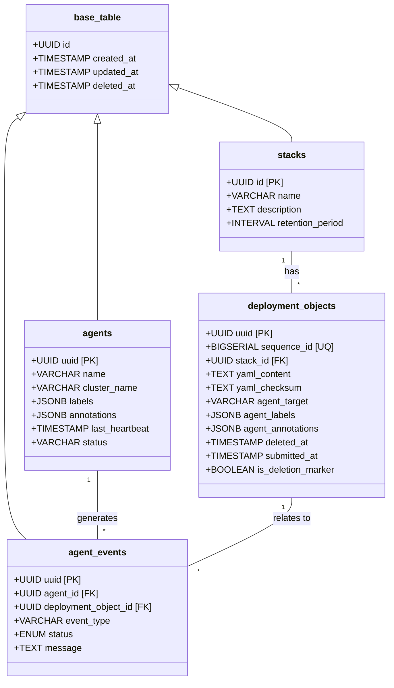

# DataModel

## Design Description:

1. Base Structure:
   - All tables inherit from `base_table`, which provides common fields like `id`, `created_at`, `updated_at`, and `deleted_at`.
   - The `update_timestamp()` function updates the `updated_at` field on any change.
   - The `soft_delete()` function sets the `deleted_at` field when a soft delete is performed.

2. Agents:
   - Represents the agents in the system.
   - Has a unique constraint on `(name, cluster_name)`.
   - Includes fields for labels, annotations, last heartbeat, and status that the Agent responds to.

3. Stacks:
   - Represents stacks in the system.
   - Has a unique constraint on `name`.

4. Deployment Objects:
   - Represents objects to be deployed.
   - Linked to a stack via `stack_id`.
   - Contains YAML content and its checksum.
   - Includes fields for targeting specific agents.
   - Has a `is_deletion_marker` flag for marking deletions.

5. Agent Events:
   - Represents events generated by agents on attempted apply.
   - Linked to both an agent and a deployment object.
   - Includes an event type, status (success/fail), and a message.

Cascading Events and Triggers:

1. Soft Delete Propagation:
   - When a stack is soft-deleted:
     a. The `handle_stack_soft_delete()` function is triggered.
     b. All existing deployment objects for the stack are soft-deleted.
     c. A new deployment object with blank content is created as a deletion marker.
   - When an agent is soft-deleted:
     a. The `cascade_soft_delete_agents()` function is triggered.
     b. All associated agent events are soft-deleted.

2. Hard Delete Propagation:
   - When a stack is hard-deleted:
     a. The `hard_delete_deployment_objects_on_stack_delete()` function is triggered.
     b. All associated agent events are hard-deleted.
     c. All deployment objects for the stack are hard-deleted.

3. Deployment Object Immutability:
   - The `prevent_deployment_object_changes()` function ensures that deployment objects cannot be modified after creation, except for soft deletion or updating deletion markers.

4. Timestamp Updates:
   - Any update to agents, stacks, or agent events triggers the `update_timestamp()` function, updating the `updated_at` field.

5. Soft Delete Mechanism:
   - Attempts to set `deleted_at` on agents, stacks, or agent events trigger the `soft_delete()` function, which sets the `deleted_at` timestamp.

