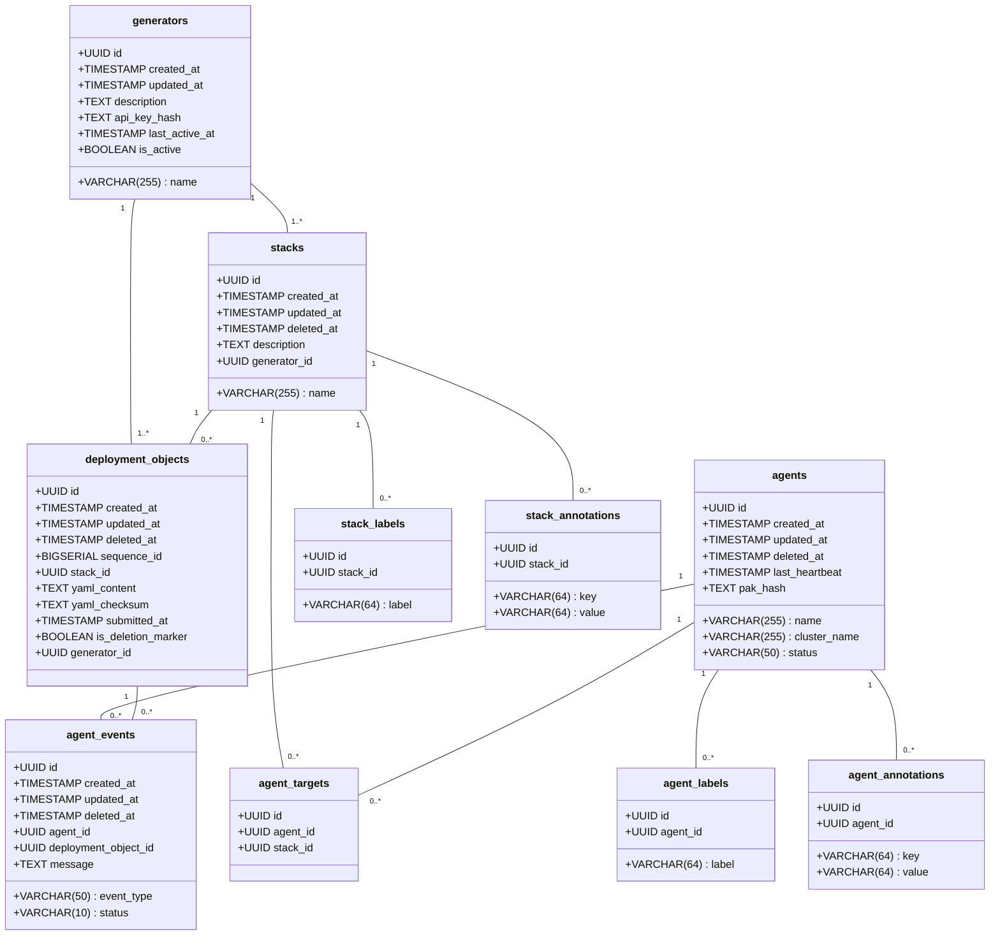
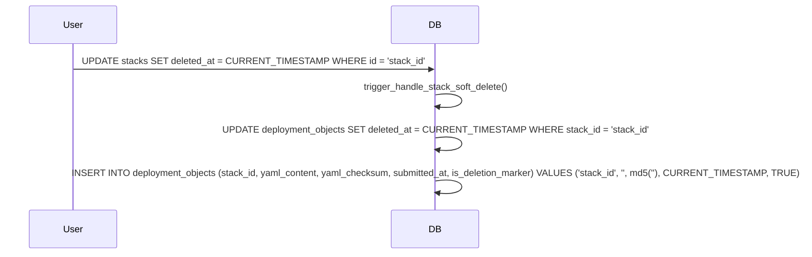
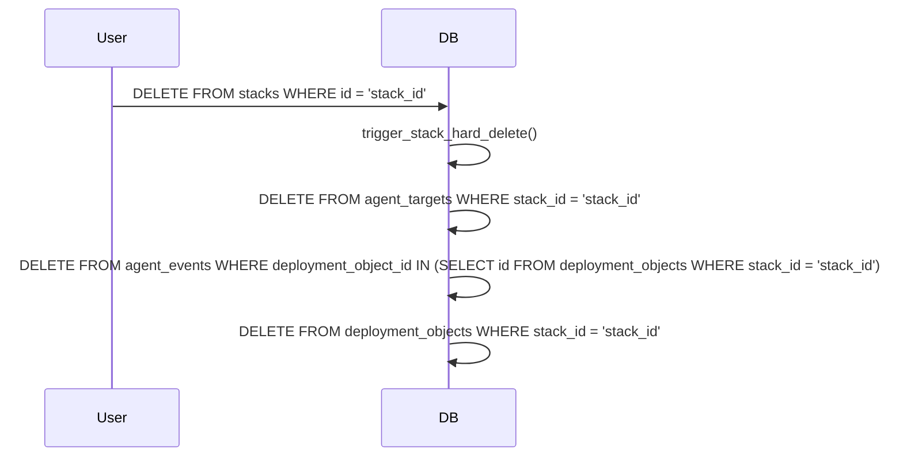
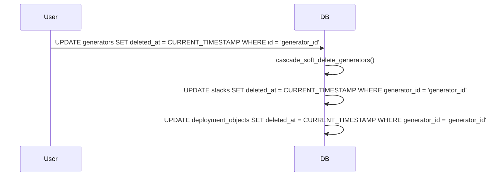
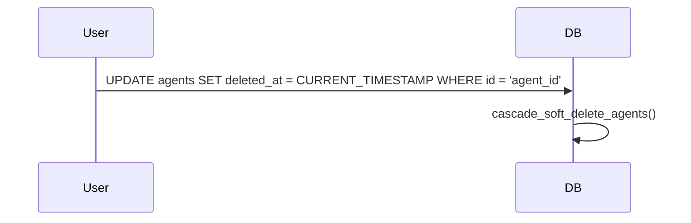

# Data Design Description




## Individual Table Descriptions

1. Stacks Table:
   - Primary key: `id` (UUID)
   - Unique constraint: `name`
   - Contains basic information about stacks including name and description
   - Has a soft delete mechanism (`deleted_at`)
   - Associated with deployment objects and agent targets
   - Includes a required `generator_id` to link to the generator that created it

2. Agents Table:
   - Primary key: `id` (UUID)
   - Stores information about agents including status, last heartbeat, and PAK hash
   - Has a soft delete mechanism (`deleted_at`)
   - Associated with agent events and agent targets

3. Deployment Objects Table:
   - Primary key: `id` (UUID)
   - Contains YAML content for deployments and its checksum
   - Has a `sequence_id` for ordering
   - Linked to a stack via `stack_id`
   - Includes `is_deletion_marker` flag for marking deletions
   - Has a soft delete mechanism (`deleted_at`)
   - Includes a required `generator_id` to link to the generator that created it

4. Agent Events Table:
   - Primary key: `id` (UUID)
   - Records events related to agents and deployment objects
   - Linked to both an agent and a deployment object
   - Includes event type, status, and a message
   - Has a soft delete mechanism (`deleted_at`)

5. Agent Targets Table:
   - Primary key: `id` (UUID)
   - Links agents with stacks
   - Unique constraint: combination of `agent_id` and `stack_id`

6. Stack Labels Table:
   - Primary key: `id` (UUID)
   - Stores labels for stacks
   - Unique constraint: combination of `stack_id` and `label`

7. Stack Annotations Table:
   - Primary key: `id` (UUID)
   - Stores key-value annotations for stacks
   - Unique constraint: combination of `stack_id` and `key`

8. Agent Labels Table:
   - Primary key: `id` (UUID)
   - Stores labels for agents
   - Unique constraint: combination of `agent_id` and `label`

9. Agent Annotations Table:
   - Primary key: `id` (UUID)
   - Stores key-value annotations for agents
   - Unique constraint: combination of `agent_id` and `key`

10. Generators Table:
    - Primary key: `id` (UUID)
    - Stores information about generators including name, description, and API key hash
    - Tracks the last active time and whether the generator is currently active
    - Associated with stacks and deployment objects that it creates

Key Features:
1. Soft Delete: All main tables support soft delete via the `deleted_at` column.
2. Timestamps: All main tables have `created_at` and `updated_at` columns, automatically managed by triggers.
3. Immutability: Deployment objects are designed to be immutable after creation, with exceptions for soft deletion and updating deletion markers.
4. Cascading Deletes: The system implements cascading soft deletes and hard deletes through triggers and functions.
5. Indexing: Appropriate indexes are created for efficient querying, especially on foreign keys and frequently used columns.

The data model supports a system where:
- Generators can create multiple stacks and deployment objects.
- Stacks can have multiple deployment objects and be targeted by multiple agents.
- Agents can generate multiple events related to deployment objects and target multiple stacks.
- Both stacks and agents can have multiple labels and annotations.
- The system maintains a history of deployments and agent activities through the deployment_objects and agent_events tables.


## Triggers and Functions

### Stacks

1. **Update Timestamp Trigger**
   - **Trigger Name:** `update_stack_timestamp`
   - **Event:** `BEFORE UPDATE`
   - **Function:** `update_timestamp()`
   - **Description:** Automatically updates the `updated_at` timestamp.

2. **Soft Delete Trigger**
   - **Trigger Name:** `trigger_handle_stack_soft_delete`
   - **Event:** `AFTER UPDATE OF deleted_at`
   - **Function:** `handle_stack_soft_delete()`
   - **Description:** Soft deletes all associated deployment objects and inserts a deletion marker.
   - **Code Reference:**
     ```sql:crates/brokkr-models/migrations/03_stacks/up.sql
     startLine: 27
     endLine: 52
     ```

3. **Hard Delete Trigger**
   - **Trigger Name:** `trigger_stack_hard_delete`
   - **Event:** `BEFORE DELETE`
   - **Function:** `handle_stack_hard_delete()`
   - **Description:** Deletes all associated agent targets, agent events, and deployment objects.
   - **Code Reference:**
     ```sql:crates/brokkr-models/migrations/03_stacks/up.sql
     startLine: 55
     endLine: 84
     ```

### Deployment Objects

1. **Update Timestamp Trigger**
   - **Trigger Name:** `update_deployment_object_timestamp`
   - **Event:** `BEFORE UPDATE`
   - **Function:** `update_timestamp()`
   - **Description:** Automatically updates the `updated_at` timestamp.

2. **Prevent Changes Trigger**
   - **Trigger Name:** `prevent_deployment_object_update`
   - **Event:** `BEFORE UPDATE`
   - **Function:** `prevent_deployment_object_changes()`
   - **Description:** Prevents changes to deployment objects except for soft deletion or updating deletion markers.
   - **Code Reference:**
     ```sql:crates/brokkr-models/migrations/04_deployment_objects/up.sql
     startLine: 27
     endLine: 50
     ```

3. **Hard Delete Trigger**
   - **Trigger Name:** `trigger_hard_delete_deployment_objects`
   - **Event:** `BEFORE DELETE ON stacks`
   - **Function:** `hard_delete_deployment_objects_on_stack_delete()`
   - **Description:** Deletes all associated agent events and deployment objects.
   - **Code Reference:**
     ```sql:crates/brokkr-models/migrations/04_deployment_objects/up.sql
     startLine: 57
     endLine: 82
     ```

### Generators

1. **Update Timestamp Trigger**
   - **Trigger Name:** `update_generators_timestamp`
   - **Event:** `BEFORE UPDATE`
   - **Function:** `update_timestamp()`
   - **Description:** Automatically updates the `updated_at` timestamp.

2. **Soft Delete Trigger**
   - **Trigger Name:** `cascade_soft_delete_generators`
   - **Event:** `AFTER UPDATE`
   - **Function:** `cascade_soft_delete_generators()`
   - **Description:** Soft deletes all associated stacks and deployment objects.
   - **Code Reference:**
     ```sql:crates/brokkr-models/migrations/02_generators/up.sql
     startLine: 24
     endLine: 45
     ```

3. **Hard Delete Trigger**
   - **Trigger Name:** `trigger_generator_hard_delete`
   - **Event:** `BEFORE DELETE`
   - **Function:** `handle_generator_hard_delete()`
   - **Description:** Handles hard deletion of generators.
   - **Code Reference:**
     ```sql:crates/brokkr-models/migrations/02_generators/up.sql
     startLine: 48
     endLine: 67
     ```

### Agents

1. **Update Timestamp Trigger**
   - **Trigger Name:** `update_agent_timestamp`
   - **Event:** `BEFORE UPDATE`
   - **Function:** `update_timestamp()`
   - **Description:** Automatically updates the `updated_at` timestamp.

2. **Soft Delete Trigger**
   - **Trigger Name:** `cascade_soft_delete_agents`
   - **Event:** `AFTER UPDATE`
   - **Function:** `cascade_soft_delete_agents()`
   - **Description:** Soft deletes all associated agent events.
   - **Code Reference:**
     ```sql:crates/brokkr-models/migrations/01_agents/up.sql
     startLine: 29
     endLine: 46
     ```

3. **Hard Delete Trigger**
   - **Trigger Name:** `trigger_agent_hard_delete`
   - **Event:** `BEFORE DELETE`
   - **Function:** `handle_agent_hard_delete()`
   - **Description:** Deletes all associated agent targets and agent events.
   - **Code Reference:**
     ```sql:crates/brokkr-models/migrations/01_agents/up.sql
     startLine: 49
     endLine: 69
     ```

## Sequence Diagrams

### Soft Delete of a Stack



### Hard Delete of a Stack



### Soft Delete of a Generator



### Soft Delete of an Agent


