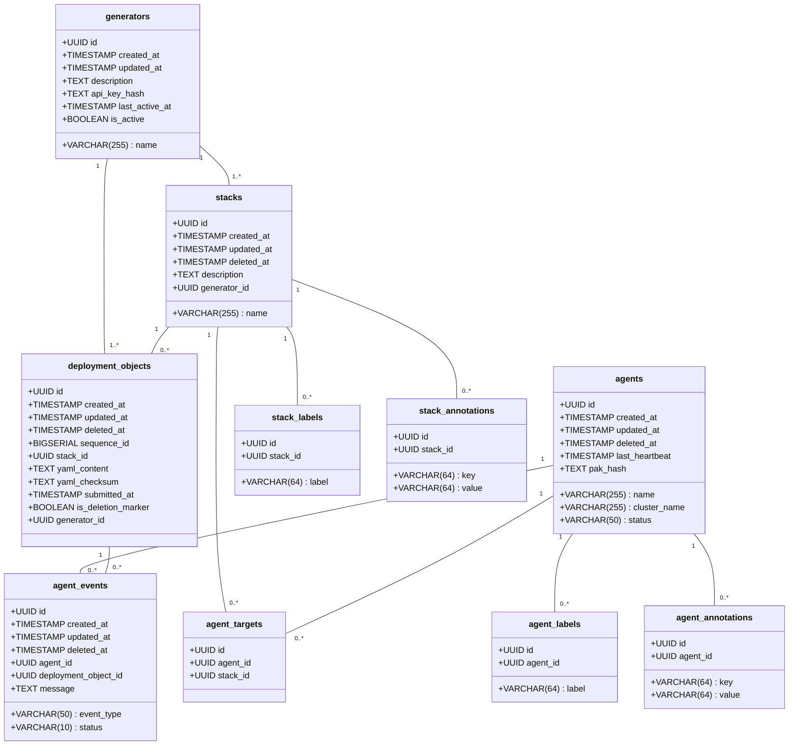

# Data Design Description

## Individual Table Descriptions

1. Stacks Table:
   - Primary key: `id` (UUID)
   - Unique constraint: `name`
   - Contains basic information about stacks including name and description
   - Has a soft delete mechanism (`deleted_at`)
   - Associated with deployment objects and agent targets
   - Now includes a required `generator_id` to link to the generator that created it

2. Agents Table:
   - Primary key: `id` (UUID)
   - Unique constraint: combination of `name` and `cluster_name`
   - Stores information about agents including status, last heartbeat, and PAK hash
   - Has a soft delete mechanism (`deleted_at`)
   - Associated with agent events and agent targets

3. Deployment Objects Table:
   - Primary key: `id` (UUID)
   - Contains YAML content for deployments and its checksum
   - Has a `sequence_id` for ordering
   - Linked to a stack via `stack_id`
   - Includes `is_deletion_marker` flag for marking deletions
   - Has a soft delete mechanism (`deleted_at`)
   - Now includes a required `generator_id` to link to the generator that created it

4. Agent Events Table:
   - Primary key: `id` (UUID)
   - Records events related to agents and deployment objects
   - Linked to both an agent and a deployment object
   - Includes event type, status, and a message
   - Has a soft delete mechanism (`deleted_at`)

5. Agent Targets Table:
   - Primary key: `id` (UUID)
   - Links agents with stacks
   - Unique constraint: combination of `agent_id` and `stack_id`

6. Stack Labels Table:
   - Primary key: `id` (UUID)
   - Stores labels for stacks
   - Unique constraint: combination of `stack_id` and `label`

7. Stack Annotations Table:
   - Primary key: `id` (UUID)
   - Stores key-value annotations for stacks
   - Unique constraint: combination of `stack_id` and `key`

8. Agent Labels Table:
   - Primary key: `id` (UUID)
   - Stores labels for agents
   - Unique constraint: combination of `agent_id` and `label`

9. Agent Annotations Table:
   - Primary key: `id` (UUID)
   - Stores key-value annotations for agents
   - Unique constraint: combination of `agent_id` and `key`

10. Generators Table:
    - Primary key: `id` (UUID)
    - Stores information about generators including name, description, and API key hash
    - Tracks the last active time and whether the generator is currently active
    - Associated with stacks and deployment objects that it creates
    - Must be associated with at least one stack or deployment object

Key Features:
1. Soft Delete: All main tables support soft delete via the `deleted_at` column.
2. Timestamps: All main tables have `created_at` and `updated_at` columns, automatically managed by triggers.
3. Immutability: Deployment objects are designed to be immutable after creation, with exceptions for soft deletion and updating deletion markers.
4. Cascading Deletes: The system implements cascading soft deletes and hard deletes through triggers and functions.
5. Indexing: Appropriate indexes are created for efficient querying, especially on foreign keys and frequently used columns.

The data model supports a system where:
- Generators can create multiple stacks and deployment objects.
- Stacks can have multiple deployment objects and be targeted by multiple agents.
- Agents can generate multiple events related to deployment objects and target multiple stacks.
- Both stacks and agents can have multiple labels and annotations.
- The system maintains a history of deployments and agent activities through the deployment_objects and agent_events tables.

[Rest of the content remains unchanged]

