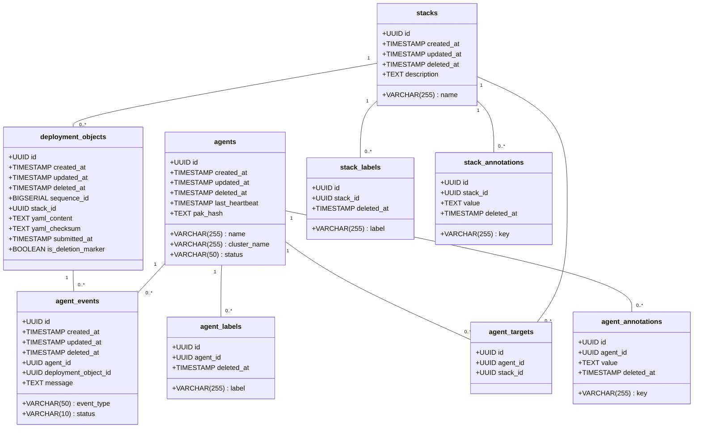
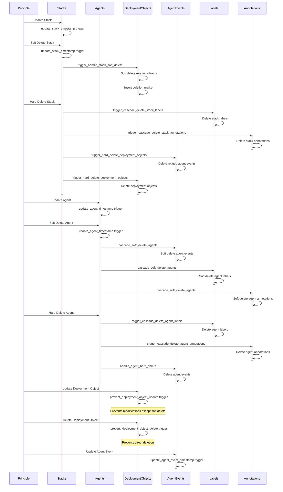

# Data Design Description

## Individual Table Descriptions

1. Stacks Table:
   - Primary key: `id` (UUID)
   - Unique constraint: `name`
   - Contains basic information about stacks including name and description
   - Has a soft delete mechanism (`deleted_at`)
   - Associated with deployment objects and agent targets

2. Agents Table:
   - Primary key: `id` (UUID)
   - Unique constraint: combination of `name` and `cluster_name`
   - Stores information about agents including status, last heartbeat, and PAK hash
   - Has a soft delete mechanism (`deleted_at`)
   - Associated with agent events and agent targets

3. Deployment Objects Table:
   - Primary key: `id` (UUID)
   - Contains YAML content for deployments and its checksum
   - Has a `sequence_id` for ordering
   - Linked to a stack via `stack_id`
   - Includes `is_deletion_marker` flag for marking deletions
   - Has a soft delete mechanism (`deleted_at`)

4. Agent Events Table:
   - Primary key: `id` (UUID)
   - Records events related to agents and deployment objects
   - Linked to both an agent and a deployment object
   - Includes event type, status, and a message
   - Has a soft delete mechanism (`deleted_at`)

5. Agent Targets Table:
   - Primary key: `id` (UUID)
   - Links agents with stacks
   - Unique constraint: combination of `agent_id` and `stack_id`

6. Stack Labels Table:
   - Primary key: `id` (UUID)
   - Stores labels for stacks
   - Unique constraint: combination of `stack_id` and `label`
   - Has a soft delete mechanism (`deleted_at`)

7. Stack Annotations Table:
   - Primary key: `id` (UUID)
   - Stores key-value annotations for stacks
   - Unique constraint: combination of `stack_id` and `key`
   - Has a soft delete mechanism (`deleted_at`)

8. Agent Labels Table:
   - Primary key: `id` (UUID)
   - Stores labels for agents
   - Unique constraint: combination of `agent_id` and `label`
   - Has a soft delete mechanism (`deleted_at`)

9. Agent Annotations Table:
   - Primary key: `id` (UUID)
   - Stores key-value annotations for agents
   - Unique constraint: combination of `agent_id` and `key`
   - Has a soft delete mechanism (`deleted_at`)

Key Features:
1. Soft Delete: All main tables support soft delete via the `deleted_at` column.
2. Timestamps: All main tables have `created_at` and `updated_at` columns, automatically managed by triggers.
3. Immutability: Deployment objects are designed to be immutable after creation, with exceptions for soft deletion and updating deletion markers.
4. Cascading Deletes: The system implements cascading soft deletes and hard deletes through triggers and functions.
5. Indexing: Appropriate indexes are created for efficient querying, especially on foreign keys and frequently used columns.

The data model supports a system where:
- Stacks can have multiple deployment objects and be targeted by multiple agents.
- Agents can generate multiple events related to deployment objects and target multiple stacks.
- Both stacks and agents can have multiple labels and annotations.
- The system maintains a history of deployments and agent activities through the deployment_objects and agent_events tables.

[Previous content remains unchanged]

## Trigger Descriptions

The schema implements several triggers to maintain data integrity, enforce business rules, and handle cascading operations. Here's a description of the main triggers:

1. **update_timestamp Trigger**
   - Applied to: All main tables (stacks, agents, deployment_objects, agent_events)
   - Triggered: Before UPDATE
   - Function: `update_timestamp()`
   - Purpose: Automatically updates the `updated_at` column with the current timestamp whenever a row is updated.

2. **update_stack_timestamp Trigger**
   - Applied to: stacks table
   - Triggered: Before UPDATE
   - Function: `update_timestamp()`
   - Purpose: Specific instance of the update timestamp trigger for the stacks table.

3. **trigger_handle_stack_soft_delete Trigger**
   - Applied to: stacks table
   - Triggered: After UPDATE of deleted_at
   - Function: `handle_stack_soft_delete()`
   - Purpose: When a stack is soft-deleted (deleted_at is set), this trigger:
     - Soft-deletes all existing deployment objects for the stack
     - Inserts a new deployment object with blank content as a deletion marker

4. **trigger_stack_hard_delete Trigger**
   - Applied to: stacks table
   - Triggered: Before DELETE
   - Function: `handle_stack_hard_delete()`
   - Purpose: When a stack is hard-deleted, this trigger:
     - Deletes associated stack labels and annotations
     - Deletes associated agent targets
     - Deletes all agent events related to the stack's deployment objects
     - Deletes all deployment objects for the stack

5. **trigger_cascade_delete_stack_labels Trigger**
   - Applied to: stacks table
   - Triggered: Before DELETE
   - Function: `cascade_delete_stack_labels()`
   - Purpose: Ensures that all associated stack labels are deleted when a stack is deleted.

6. **trigger_cascade_delete_stack_annotations Trigger**
   - Applied to: stacks table
   - Triggered: Before DELETE
   - Function: `cascade_delete_stack_annotations()`
   - Purpose: Ensures that all associated stack annotations are deleted when a stack is deleted.

7. **update_agent_timestamp Trigger**
   - Applied to: agents table
   - Triggered: Before UPDATE
   - Function: `update_timestamp()`
   - Purpose: Specific instance of the update timestamp trigger for the agents table.

8. **cascade_soft_delete_agents Trigger**
   - Applied to: agents table
   - Triggered: After UPDATE of deleted_at
   - Function: `cascade_soft_delete_agents()`
   - Purpose: When an agent is soft-deleted, this trigger soft-deletes associated agent events, labels, and annotations.

9. **trigger_agent_hard_delete Trigger**
   - Applied to: agents table
   - Triggered: Before DELETE
   - Function: `handle_agent_hard_delete()`
   - Purpose: When an agent is hard-deleted, this trigger:
     - Deletes associated agent labels and annotations
     - Deletes associated agent targets
     - Deletes associated agent events

10. **trigger_cascade_delete_agent_labels Trigger**
    - Applied to: agents table
    - Triggered: Before DELETE
    - Function: `cascade_delete_agent_labels()`
    - Purpose: Ensures that all associated agent labels are deleted when an agent is deleted.

11. **trigger_cascade_delete_agent_annotations Trigger**
    - Applied to: agents table
    - Triggered: Before DELETE
    - Function: `cascade_delete_agent_annotations()`
    - Purpose: Ensures that all associated agent annotations are deleted when an agent is deleted.

12. **update_deployment_object_timestamp Trigger**
    - Applied to: deployment_objects table
    - Triggered: Before UPDATE
    - Function: `update_timestamp()`
    - Purpose: Specific instance of the update timestamp trigger for the deployment_objects table.

13. **prevent_deployment_object_update Trigger**
    - Applied to: deployment_objects table
    - Triggered: Before UPDATE
    - Function: `prevent_deployment_object_changes()`
    - Purpose: Prevents modifications to deployment objects except for soft deletion and updating deletion markers.

14. **prevent_deployment_object_delete Trigger**
    - Applied to: deployment_objects table
    - Triggered: Before DELETE
    - Function: `prevent_deployment_object_changes()`
    - Purpose: Prevents direct deletion of deployment objects (deletions are handled through the stack deletion process).

15. **trigger_hard_delete_deployment_objects Trigger**
    - Applied to: stacks table
    - Triggered: Before DELETE
    - Function: `hard_delete_deployment_objects_on_stack_delete()`
    - Purpose: When a stack is hard-deleted, this trigger:
     - Deletes all agent events associated with the stack's deployment objects
     - Deletes all deployment objects for the stack

16. **update_agent_event_timestamp Trigger**
    - Applied to: agent_events table
    - Triggered: Before UPDATE
    - Function: `update_timestamp()`
    - Purpose: Specific instance of the update timestamp trigger for the agent_events table.

