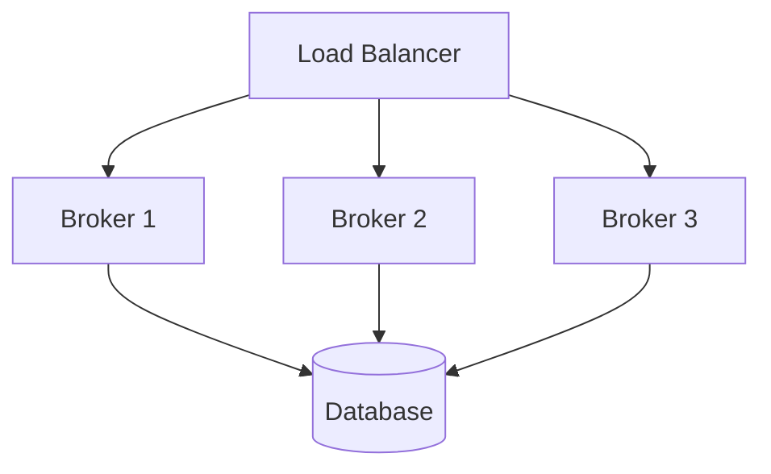
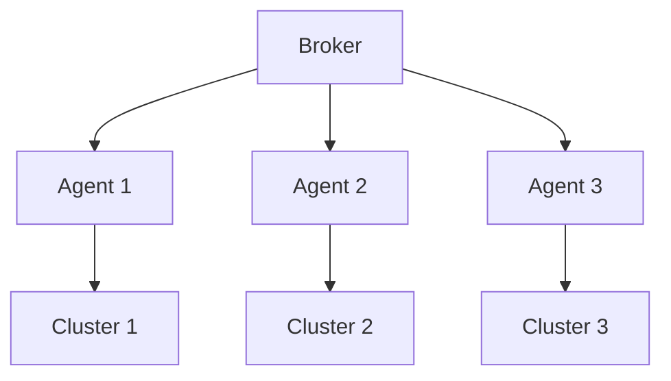
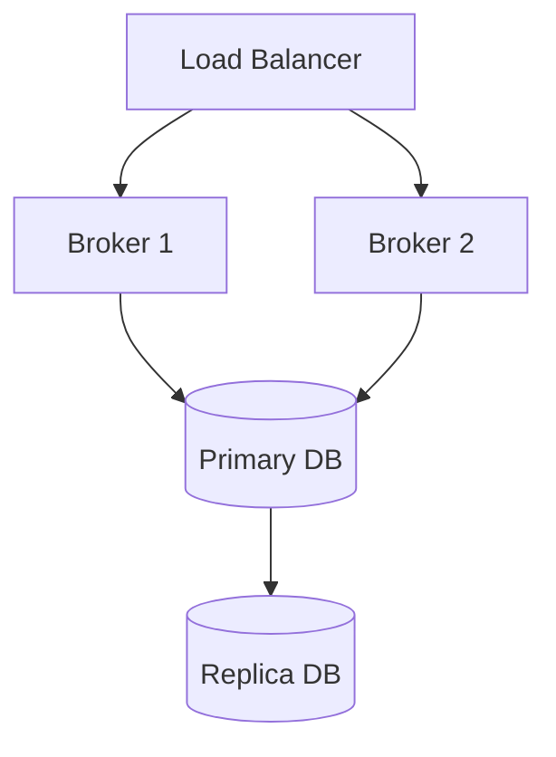
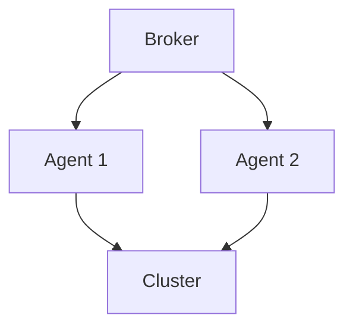

# Technical Architecture

This document provides detailed technical implementation information about Brokkr's architecture, focusing on performance, scaling, and deployment patterns.

## Implementation Details

### Broker Service Implementation

#### API Server
- Built with Axum web framework
- Async request handling with Tokio runtime
- Middleware-based authentication and authorization
- Request validation using Serde
- OpenAPI/Swagger documentation generation

#### Database Layer
- PostgreSQL with SQLx for async database access
- Connection pooling with deadpool
- Transaction management with automatic rollback
- Optimistic locking for concurrent updates
- Prepared statement caching

#### Event System
- In-memory event bus for internal communication
- WebSocket-based real-time updates
- Event batching for performance
- Event persistence for audit trail
- Event replay capabilities

### Agent Service Implementation

#### Kubernetes Client
- Dynamic client generation
- Resource watching with exponential backoff
- Custom resource definition support
- Resource validation using OpenAPI schemas
- Conflict resolution strategies

#### State Management
- In-memory state cache
- Periodic state reconciliation
- Optimistic concurrency control
- State persistence for recovery
- State diff calculation

## Performance Characteristics

### Broker Performance

#### API Performance
- Request latency: < 50ms for 95th percentile
- Concurrent request handling: 1000+ requests/second
- WebSocket connections: 1000+ concurrent
- Event processing: 5000+ events/second

#### Database Performance
- Query latency: < 20ms for 95th percentile
- Connection pool: 20-100 connections
- Transaction throughput: 1000+ TPS
- Cache hit ratio: > 90%

### Agent Performance

#### Resource Application
- Resource application latency: < 100ms
- Concurrent resource updates: 100+
- State reconciliation: < 1s
- Event reporting: < 50ms

#### Kubernetes API
- API request latency: < 200ms
- Watch connection stability: 99.9%
- Resource validation: < 50ms
- Conflict resolution: < 100ms

## Scaling Patterns

### Horizontal Scaling

#### Broker Scaling


- Stateless design enables horizontal scaling
- Shared database for state persistence
- Load balancer for request distribution
- Session affinity for WebSocket connections
- Distributed caching with Redis

#### Agent Scaling


- One agent per cluster
- Independent operation
- No inter-agent communication
- Local state management
- Cluster-specific configuration

### Vertical Scaling

#### Resource Requirements

| Component | CPU | Memory | Storage |
|-----------|-----|--------|---------|
| Broker    | 2-4 cores | 4-8GB | 20GB |
| Agent     | 1-2 cores | 2-4GB | 10GB |
| Database  | 4-8 cores | 8-16GB | 100GB+ |

#### Scaling Triggers
- CPU utilization > 70%
- Memory utilization > 80%
- Request latency > 100ms
- Connection count > 1000
- Event queue length > 1000

## Deployment Patterns

### High Availability

#### Broker HA


- Active-active deployment
- Database replication
- Automatic failover
- Health checking
- Graceful shutdown

#### Agent HA


- Active-passive deployment
- Leader election
- State synchronization
- Automatic failover
- Health monitoring

### Disaster Recovery

#### Backup Strategy
- Database backups every 6 hours
- Point-in-time recovery
- Cross-region replication
- Backup verification
- Recovery testing

#### Recovery Procedures
1. Database restoration
2. Broker service recovery
3. Agent reconnection
4. State reconciliation
5. Health verification

## Monitoring and Debugging

### Metrics Collection

#### Broker Metrics
- Request latency
- Error rates
- Connection counts
- Queue lengths
- Cache statistics
- Database performance
- Event processing

#### Agent Metrics
- Resource application
- State reconciliation
- API latency
- Error rates
- Memory usage
- CPU utilization
- Network I/O

### Logging

#### Log Levels
- ERROR: System errors
- WARN: Potential issues
- INFO: Normal operation
- DEBUG: Detailed debugging
- TRACE: Verbose tracing

#### Log Format
```json
{
  "timestamp": "2024-03-14T12:00:00Z",
  "level": "INFO",
  "component": "broker",
  "trace_id": "abc123",
  "message": "Request processed",
  "metadata": {
    "request_id": "xyz789",
    "duration_ms": 45,
    "status": "success"
  }
}
```

### Tracing

#### Trace Points
- Request handling
- Database operations
- Event processing
- Resource application
- State reconciliation
- Error handling

#### Trace Context
- Request ID
- Parent span
- Component
- Operation
- Duration
- Status

## Troubleshooting Guide

### Common Issues

#### Broker Issues
1. **High Latency**
   - Check database performance
   - Monitor connection pool
   - Verify cache hit ratio
   - Check system resources

2. **Connection Issues**
   - Verify network connectivity
   - Check firewall rules
   - Monitor connection limits
   - Review error logs

3. **Database Issues**
   - Check connection pool
   - Monitor query performance
   - Verify transaction logs
   - Review error messages

#### Agent Issues
1. **Resource Application**
   - Check Kubernetes API access
   - Verify resource validation
   - Monitor state reconciliation
   - Review error logs

2. **State Management**
   - Check state cache
   - Verify state persistence
   - Monitor reconciliation
   - Review error messages

3. **Communication Issues**
   - Verify broker connectivity
   - Check authentication
   - Monitor heartbeat
   - Review error logs

### Debugging Tools

#### Broker Tools
- API debugging
- Database inspection
- Event tracing
- Performance profiling
- Memory analysis

#### Agent Tools
- Resource inspection
- State analysis
- API debugging
- Performance profiling
- Memory analysis

## Performance Tuning

### Broker Tuning

#### API Server
- Thread pool size
- Connection limits
- Request timeout
- Buffer sizes
- Cache settings

#### Database
- Connection pool size
- Statement cache
- Transaction timeout
- Batch size
- Index optimization

### Agent Tuning

#### Kubernetes Client
- Watch timeout
- Retry settings
- Batch size
- Cache settings
- Resource limits

#### State Management
- Cache size
- Reconciliation interval
- Batch size
- Persistence interval
- Cleanup settings
