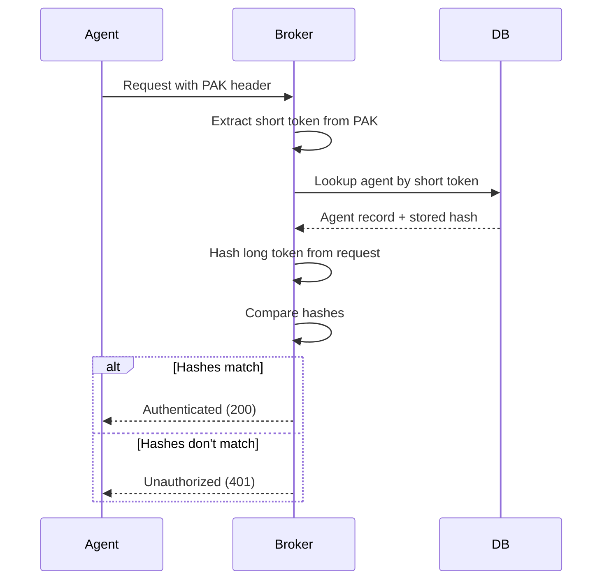

# Security Model

This document describes Brokkr's security architecture, including trust boundaries, authentication mechanisms, authorization model, and security best practices.

## Trust Boundaries


flowchart TB
    subgraph Untrusted["Untrusted Zone"]
        Internet[Internet/External]
        Admin[Admin Users]
        Generator[Generators/CI]
    end

    subgraph DMZ["DMZ / Edge"]
        Ingress[Ingress Controller]
        TLS[TLS Termination]
    end

    subgraph Trusted["Trusted Zone"]
        Broker[Broker Service]
        DB[(PostgreSQL)]
    end

    subgraph SemiTrusted["Semi-Trusted Zone (per cluster)"]
        Agent[Agent]
        K8s[Kubernetes API]
    end

    Internet --> Ingress
    Admin --> Ingress
    Generator --> Ingress
    Ingress --> TLS
    TLS --> Broker
    Broker <--> DB
    Agent --> Broker
    Agent --> K8s


### Zone Definitions

| Zone | Components | Trust Level | Access Granted |
|------|------------|-------------|----------------|
| **Untrusted** | External clients, admins, generators | None | Must authenticate |
| **DMZ** | Ingress, TLS termination | Transport | TLS encryption |
| **Trusted** | Broker, PostgreSQL | Full | Internal communication |
| **Semi-Trusted** | Agents | Scoped | Own cluster resources only |

### Key Principles

1. **Zero Trust by Default**: All external requests require authentication
2. **Least Privilege**: Agents can only access their own resources
3. **Defense in Depth**: Multiple layers of security controls
4. **Immutable Audit Trail**: All actions are logged and cannot be modified

## Authentication Mechanisms

### PAK (Pre-Authentication Key)

PAKs are the primary authentication mechanism for agents.

#### Structure

```
brokkr_BR{short_token}_{long_token}
       ^  ^            ^
       |  |            |
       |  |            +-- Long token (secret, used for verification)
       |  +--------------- Short token (identifier, can be logged)
       +------------------ Prefix (identifies key type)
```

**Example**: `brokkr_BRabc123_xyzSecretTokenHere...`

#### Generation

PAKs are generated when an agent is created:

1. Random short token generated (identifier)
2. Random long token generated (secret)
3. Long token hashed with SHA-256
4. Hash stored in database
5. Full PAK returned to client (once only)

#### Verification



#### Security Properties

| Property | Implementation |
|----------|----------------|
| **Secrecy** | Long token never stored (only hash) |
| **Non-repudiation** | PAK uniquely identifies the agent |
| **Revocation** | Agent can be disabled in database |
| **Rotation** | New PAK can be generated, old one invalidated |

### Admin Authentication

Admin users authenticate via tokens for management operations.

#### Token Usage

```bash
# Admin API calls
curl -X POST https://broker.example.com/api/v1/admin/config/reload \
  -H "Authorization: Bearer <admin-token>"
```

#### Permissions

Admin tokens grant access to:
- Configuration reload
- Audit log queries
- System health endpoints
- User/agent management

### Generator Authentication

Generators (CI/CD systems) use API keys for automated deployments.

#### Key Usage

```bash
# Generator API calls
curl -X POST https://broker.example.com/api/v1/stacks \
  -H "X-Generator-Key: <generator-key>" \
  -H "Content-Type: application/json" \
  -d '{"name": "my-stack"}'
```

#### Permissions

Generators can:
- Create, update, delete stacks
- Create deployment objects
- Query their own resources

Generators cannot:
- Access admin endpoints
- Manage agents or other generators
- Access resources created by other generators

## Authorization Model

### Role-Based Access Control

Brokkr implements implicit RBAC based on authentication type:

| Role | Authentication | Permissions |
|------|----------------|-------------|
| **Agent** | PAK | Read targeted deployments, report events |
| **Generator** | API Key | Manage own stacks and deployments |
| **Admin** | Admin Token | Full system access |
| **System** | Internal | Background tasks, cleanup |

### API Endpoint Permissions

| Endpoint Pattern | Agent | Generator | Admin |
|------------------|-------|-----------|-------|
| `/api/v1/agent/*` | Yes | No | No |
| `/api/v1/stacks/*` | No | Yes | Yes |
| `/api/v1/agents/*` | No | No | Yes |
| `/api/v1/admin/*` | No | No | Yes |
| `/healthz` | Yes | Yes | Yes |
| `/metrics` | No | No | Yes |

### Resource-Level Access Control

#### Agent Scope

Agents can only access:
- Deployment objects targeted at them (via agent_targets)
- Work orders assigned to them
- Their own agent record

```sql
-- Example: Agent can only see their targeted deployments
SELECT do.* FROM deployment_objects do
JOIN agent_targets at ON at.stack_id = do.stack_id
WHERE at.agent_id = :requesting_agent_id
  AND at.deleted_at IS NULL
  AND do.deleted_at IS NULL;
```

#### Generator Scope

Generators can only access:
- Stacks they created (generator_id matches)
- Deployment objects in their stacks

## Credential Management

### Storage

| Credential Type | Storage Location | Encryption |
|-----------------|------------------|------------|
| PAK hash | PostgreSQL | Hashed (SHA-256) |
| Admin tokens | PostgreSQL | Hashed |
| Generator keys | PostgreSQL | Hashed |
| Webhook secrets | PostgreSQL | Encrypted (AES-256-GCM) |
| Database password | Kubernetes Secret | Base64 (use sealed-secrets in production) |

### Rotation Procedures

#### Rotating Agent PAK

```bash
# 1. Generate new PAK via API
curl -X POST https://broker/api/v1/agents/{id}/rotate-pak \
  -H "Authorization: Bearer <admin-token>"
# Returns: new PAK

# 2. Update agent configuration with new PAK
kubectl set env deployment/brokkr-agent BROKKR__BROKER__PAK=<new-pak>

# 3. Agent reconnects with new PAK
```

#### Rotating Webhook Encryption Key

> **Warning**: Rotating the webhook encryption key will invalidate all existing webhook secrets. Webhooks will need to be reconfigured.

```yaml
# Update broker configuration
broker:
  webhookEncryptionKey: "<new-32-byte-hex-key>"

# Restart broker to apply
kubectl rollout restart deployment/brokkr-broker
```

### Revocation

#### Revoking Agent Access

```bash
# Disable agent (immediate effect)
curl -X DELETE https://broker/api/v1/agents/{id} \
  -H "Authorization: Bearer <admin-token>"
```

After revocation:
- Agent's PAK becomes invalid immediately
- Existing deployments remain in cluster
- Agent cannot fetch new deployments or report events

## Network Security

### TLS Requirements

| Connection | TLS Required | Minimum Version |
|------------|--------------|-----------------|
| External → Broker | Yes | TLS 1.2 |
| Agent → Broker | Recommended | TLS 1.2 |
| Broker → PostgreSQL | Recommended | TLS 1.2 |
| Broker → Webhooks | Yes | TLS 1.2 |

### Certificate Management

**Option 1: Ingress TLS (Recommended)**
```yaml
ingress:
  enabled: true
  tls:
    - secretName: brokkr-tls
      hosts:
        - broker.example.com
```

**Option 2: Cert-Manager**
```yaml
tls:
  enabled: true
  certManager:
    enabled: true
    issuer: letsencrypt-prod
    issuerKind: ClusterIssuer
```

**Option 3: Existing Secret**
```yaml
tls:
  enabled: true
  existingSecret: my-tls-secret
```

### Network Policies

See [Network Flows](/explanation/network-flows) for detailed NetworkPolicy examples.

**Minimum Recommended Policies:**
- Broker: Allow ingress from agents and ingress controller only
- Broker: Allow egress to PostgreSQL and webhook destinations only
- Agent: Allow egress to broker and Kubernetes API only

## Security Best Practices

### Production Deployment Checklist

- [ ] **TLS Everywhere**: Enable TLS for all external connections
- [ ] **Strong Secrets**: Use cryptographically secure random values for all secrets
- [ ] **External Database**: Use managed PostgreSQL with encryption at rest
- [ ] **Secret Management**: Use Kubernetes Secrets with encryption (or external vault)
- [ ] **NetworkPolicy**: Enable and configure network policies
- [ ] **RBAC**: Use minimal required permissions for service accounts
- [ ] **Pod Security**: Enable pod security standards (restricted)
- [ ] **Audit Logging**: Enable and monitor audit logs
- [ ] **Resource Limits**: Set CPU/memory limits to prevent DoS
- [ ] **Image Scanning**: Scan container images for vulnerabilities

### Container Security

The Helm charts configure secure defaults:

```yaml
# Pod security context
podSecurityContext:
  runAsNonRoot: true
  runAsUser: 10001
  fsGroup: 10001

# Container security context
containerSecurityContext:
  allowPrivilegeEscalation: false
  readOnlyRootFilesystem: false  # Enable if possible
  capabilities:
    drop:
      - ALL
```

### Monitoring for Security Events

#### Key Metrics to Monitor

| Metric | Alert Threshold | Indicates |
|--------|-----------------|-----------|
| Failed auth attempts | > 10/min | Brute force attack |
| Agent disconnections | Unexpected | Possible compromise |
| Webhook delivery failures | > 50% | Network issues or attack |
| Audit log volume | Sudden spike | Unusual activity |

#### Audit Log Queries

```bash
# Recent authentication failures
curl "https://broker/api/v1/admin/audit-logs?action=auth.failed&limit=100" \
  -H "Authorization: Bearer <admin-token>"

# Actions by specific agent
curl "https://broker/api/v1/admin/audit-logs?actor_type=agent&actor_id=<uuid>" \
  -H "Authorization: Bearer <admin-token>"

# All admin actions
curl "https://broker/api/v1/admin/audit-logs?actor_type=admin" \
  -H "Authorization: Bearer <admin-token>"
```

### Incident Response

#### Suspected Agent Compromise

1. **Revoke immediately**: Delete or disable the agent
2. **Review audit logs**: Check for unauthorized actions
3. **Inspect cluster**: Review resources created by the agent
4. **Rotate secrets**: Generate new PAK if re-enabling
5. **Investigate**: Determine root cause

#### Suspected Broker Compromise

1. **Isolate**: Remove external access to broker
2. **Preserve evidence**: Capture logs and database state
3. **Rotate all credentials**: PAKs, admin tokens, generator keys
4. **Review webhooks**: Check for unauthorized webhook configurations
5. **Audit database**: Review for unauthorized changes

## Compliance Considerations

### Data Protection

- **Audit logs**: Retained for configurable period (default: 90 days)
- **PII**: Agent names and descriptions may contain PII; handle accordingly
- **Encryption**: Webhook secrets encrypted at rest
- **Access logs**: All API access logged with actor identification

### Regulatory Requirements

| Requirement | Brokkr Feature |
|-------------|----------------|
| Access control | PAK + role-based authorization |
| Audit trail | Immutable audit logs |
| Data encryption | TLS in transit, encrypted secrets |
| Least privilege | Scoped agent access |
| Monitoring | Metrics + audit log API |
