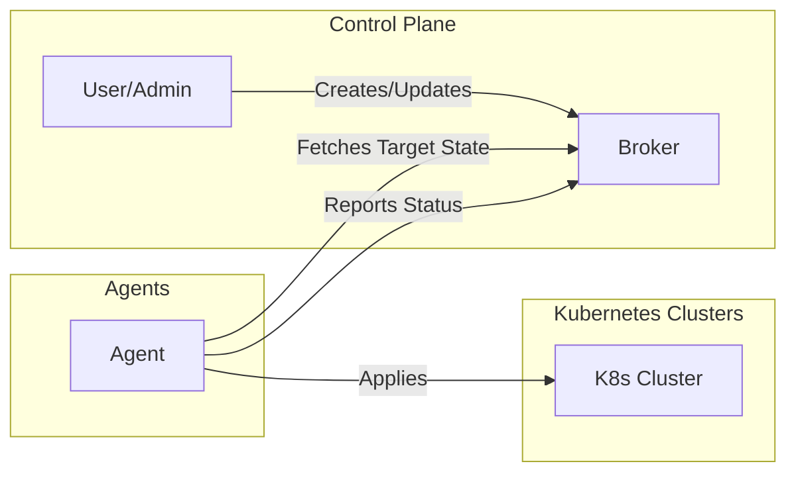
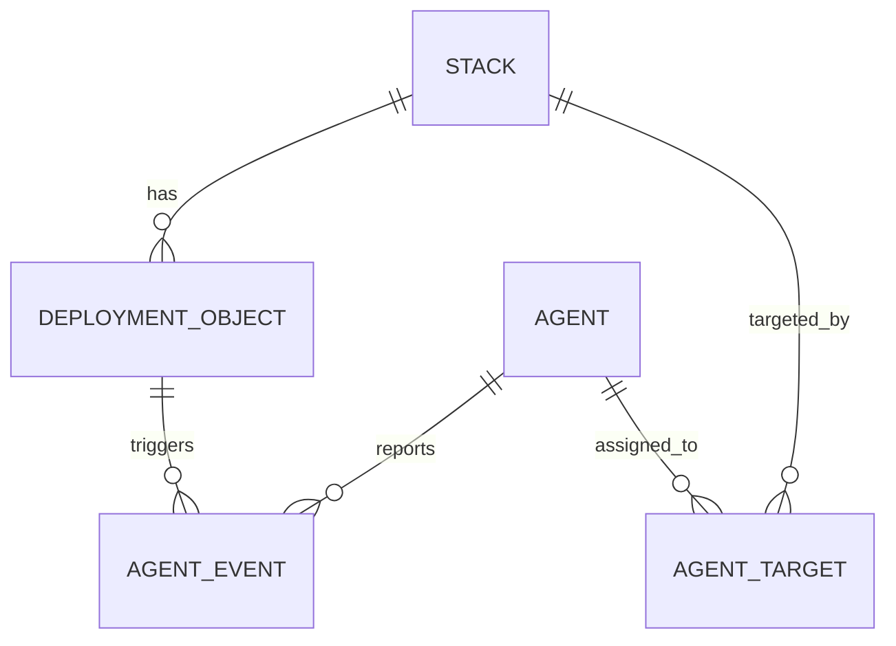
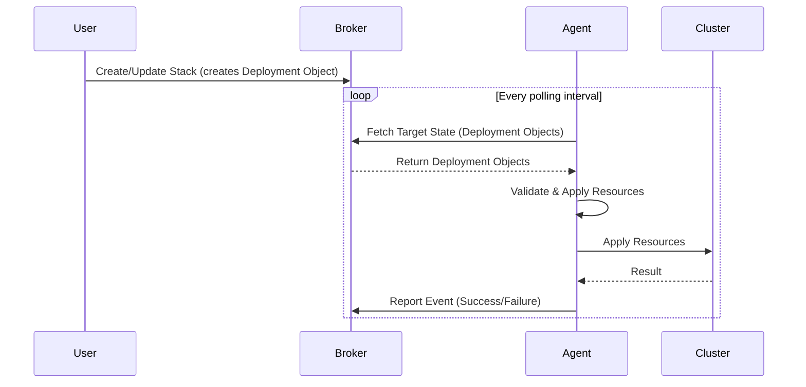
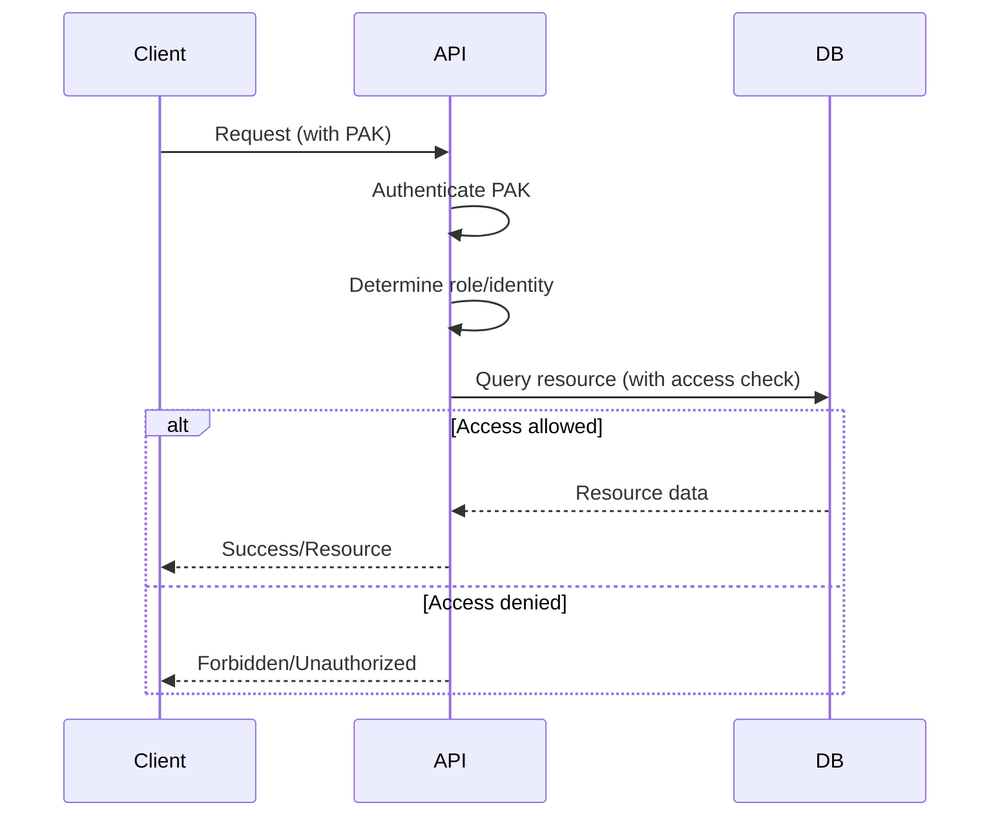

## What is Brokkr?

Brokkr is an environment-aware control plane for dynamically distributing Kubernetes objects. It tracks not just what to deploy, but where and when, based on each environment's specific needs and policies.

*Note: This diagram shows a single agent and cluster for clarity. In real deployments, Brokkr supports multiple agents and clusters, each following the same pattern.*

---

## Key Components

### The Broker: The Source of Truth

The Broker is Brokkr's central source of truth. It records the desired state of your applications and environments and exposes a REST API for users and agents to interact with that state. It does not control clusters or push deployments; instead it maintains the authoritative record of what should exist and lets agents pull that information on their own schedule.

The broker handles authentication and authorization for every request, ensuring agents and generators only access resources they're permitted to see. As agents report their activities, it records those events to maintain a complete audit trail across your infrastructure.

### The Agent: The Executor

Agents are the workhorses that make Brokkr's desired state a reality in your Kubernetes clusters. Each agent runs within a specific environment, typically a single Kubernetes cluster, and takes full responsibility for that environment's alignment with the broker's desired state.

On a regular polling interval, agents contact the broker to fetch their target state—the deployment objects they should apply. They then validate these resources locally, checking YAML syntax and ensuring the resources make sense for their environment. After validation, agents apply the resources to their local Kubernetes cluster and report the results back to the broker.

This pull-based model has important advantages. Agents in restricted networks or behind firewalls can still receive deployments by initiating outbound connections to the broker. The model also provides natural resilience; if an agent goes offline temporarily, it simply catches up on missed changes when it reconnects.

---

## Internal Data Architecture

Brokkr's data model tracks what should be deployed, where, and by whom, while maintaining a clear audit trail of what has actually occurred. Understanding these entities helps you work effectively with the system.

### Stacks

A Stack is a collection of related Kubernetes objects managed as a unit. Stacks provide the organizational boundary for grouping resources that belong together—perhaps all the components of a microservice, or all the infrastructure for a particular application. Beyond this grouping, Brokkr imposes no particular structure or semantics on stacks.

### Deployment Objects

A Deployment Object is a versioned snapshot of all Kubernetes resources in a Stack at a particular point in time. Each time you update a Stack, Brokkr creates a new Deployment Object capturing that desired state. These objects are immutable once created, providing a complete historical record of changes. This immutability means you can always see exactly what was deployed at any point in the past.

### Agents

An Agent represents a Brokkr process running in a specific environment. Agents have unique identities, authentication credentials, and metadata describing their capabilities and characteristics. The broker tracks which agents are registered, their current status, and their assignment to various stacks.

### Agent Targets

An Agent Target is an *explicit* association between an Agent and a Stack, created only via `POST /api/v1/agents/{id}/targets`. Most agent-to-stack associations are not stored as rows at all — they are resolved at read time on each poll from label and annotation matches (see Targeting Mechanisms below). Agent Targets exist for cases where you want to pin a specific agent to a specific stack regardless of labels; a stack may be targeted by multiple agents and an agent may target multiple stacks.

### Agent Events

Agent Events record the outcome of each attempt to apply a Deployment Object. When an agent applies resources and reports back to the broker, that report becomes an event in the system's history. Events capture both successes and failures, providing an audit trail that's essential for troubleshooting and compliance requirements.

---

## Targeting Mechanisms

Brokkr provides flexible mechanisms for associating agents with stacks, allowing you to model a variety of deployment scenarios.

**Direct Assignment** offers the simplest approach: explicitly associate an agent with a stack by their IDs. This works well when you have a clear one-to-one mapping between agents and the stacks they should manage.

**Label-Based Targeting** enables dynamic, scalable associations. Both agents and stacks can carry labels, and you can configure stacks to target all agents with matching labels. This supports patterns like "all production agents should receive all production stacks" without maintaining explicit associations for each pair.

**Annotation-Based Targeting** extends the label concept with key-value pairs that can encode more complex matching rules. Annotations are useful when targeting logic requires more nuance than simple label presence—for example, targeting agents in a specific region or with particular capabilities.

| Targeting Method      | Example Use Case                        |
|----------------------|-----------------------------------------|
| Direct Assignment    | Agent A manages Stack X specifically    |
| Label-Based          | All "prod" agents manage all "prod" stacks |
| Annotation-Based     | Agents with region=us-east manage stacks with region=us-east |

---

## How These Pieces Fit Together

The data entities connect to form a complete deployment workflow. Users create Stacks to group their Kubernetes resources. Each Stack accumulates Deployment Objects as its contents change over time. Agents register with the broker and become responsible for Stacks through label/annotation matches resolved at read time, plus any explicit Agent Targets.

When an Agent polls the broker, it receives the latest Deployment Objects for its associated Stacks. The Agent validates and applies these resources to its Kubernetes cluster, then reports the outcome as Agent Events. This cycle repeats continuously, keeping all clusters aligned with the desired state recorded in the broker.

This architecture provides a clear, auditable, and scalable foundation for managing Kubernetes resources across many environments.

---

## The Deployment Journey

The deployment process is pull-based: agents fetch, validate, and apply their assigned target state, while the broker holds the source of truth and records events without ever pushing deployments or performing environment-specific validation. The sequence below traces a single update from a stack change through apply to the reported event:

## Security Model

Brokkr uses API key authentication and role-based authorization for all API access. Every request must include a valid PAK (Prefixed API Key) in the Authorization header.

### Authentication

The system supports three types of PAKs, each granting different levels of access. Admin PAKs provide full administrative access to all API endpoints and resources. Agent PAKs grant access only to endpoints and data relevant to a specific agent, such as fetching target state and reporting events. Generator PAKs allow external systems to create resources within their designated scope.

When a request arrives, the API middleware extracts the PAK from the Authorization header and verifies it against stored hashes. If the PAK matches a known admin, agent, or generator, the request proceeds with that identity and role attached. Invalid or missing PAKs result in authentication failures.

### Authorization

Beyond authentication, Brokkr enforces role-based access control at every endpoint. Certain operations require admin privileges: creating agents, listing all resources, managing system configuration. Agent endpoints ensure that each agent can only access its own target state and report its own events. Generator endpoints similarly restrict access to each generator's own resources.

The system also enforces row-based access control within endpoints. After authenticating a request, the API verifies that the requesting entity has permission to access each specific resource. An agent fetching deployment objects receives only those for stacks it's assigned to. A generator creating a stack can only access stacks it created. This fine-grained control ensures that even authenticated entities can only see and modify what they're supposed to.

### Key Management

PAKs are generated using secure random generation and stored as hashes in the database. The actual PAK value is shown only once at creation or rotation time, so it must be captured and stored securely at that moment. Both agents and generators can rotate their own PAKs, and administrators can rotate any PAK in the system.

---

## Next Steps

With an understanding of Brokkr's core concepts, you can explore further:

- Follow the [Deploy Your First Application](../tutorials/first-deployment.md) tutorial to deploy your first application
- Study the [Technical Architecture](./architecture.md) for implementation details
- Explore the [Data Model](./data-model.md) to understand entity relationships
- Read the [Security Model](./security-model.md) for comprehensive authentication and authorization details
