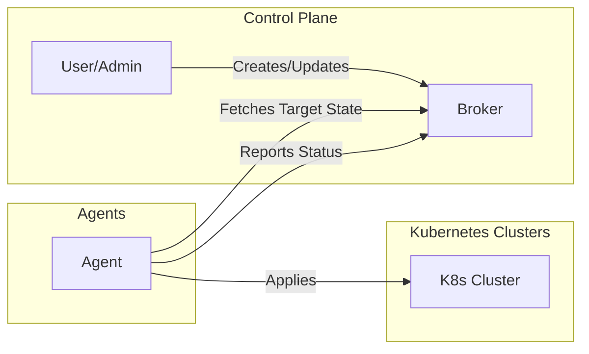
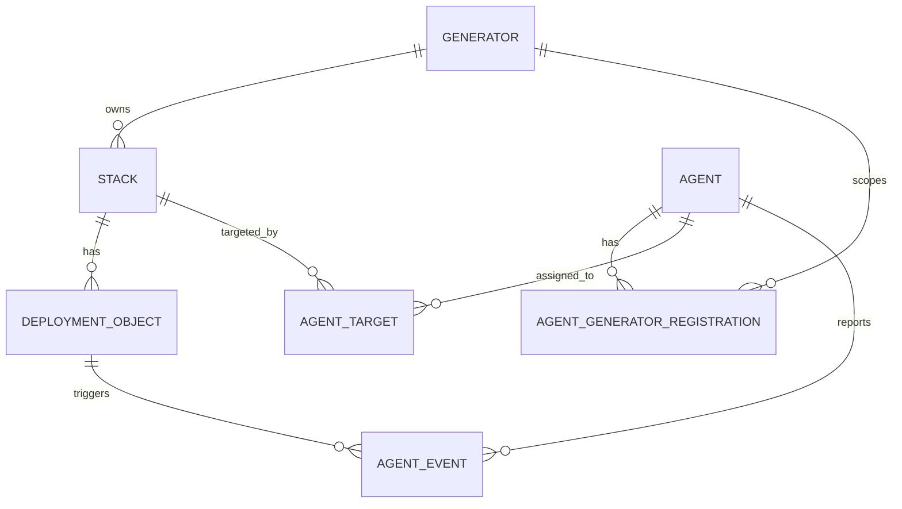
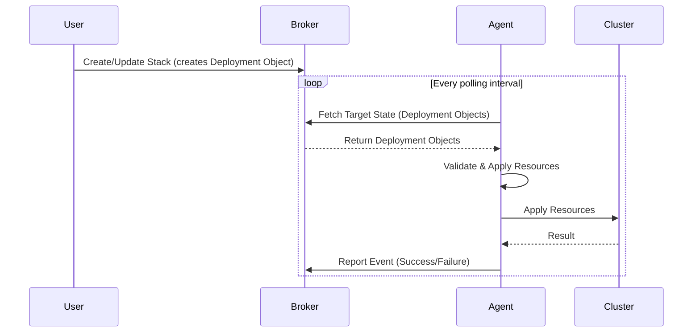
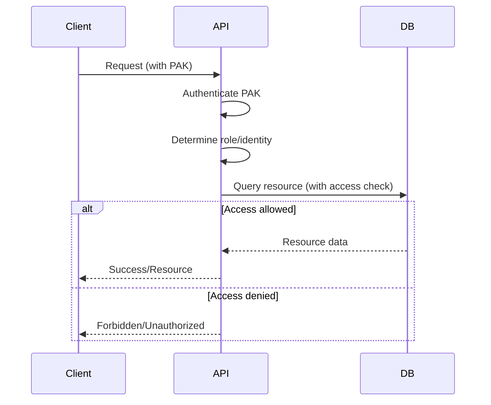

## What is Brokkr?

Brokkr is an environment-aware control plane for dynamically distributing Kubernetes objects. It tracks not just what to deploy, but where and when, based on each environment's specific needs and policies.

```mermaid
graph LR
    subgraph "Control Plane"
        UA[User/Admin] -->|Creates/Updates| BR[Broker]
    end

    subgraph "Agents"
        AG[Agent]
    end

    subgraph "Kubernetes Clusters"
        KC[K8s Cluster]
    end

    AG -- Fetches Target State --> BR
    AG -- Reports Status --> BR
    AG -- Applies --> KC
```

*Note: This diagram shows a single agent and cluster for clarity. In real deployments, Brokkr supports multiple agents and clusters, each following the same pattern.*

---

## Key Components

### The Broker: The Source of Truth

The Broker is Brokkr's central source of truth. It records the desired state of your applications and environments and exposes a REST API for users and agents to interact with that state. It does not control clusters or push deployments; instead it maintains the authoritative record of what should exist and lets agents pull that information on their own schedule.

The broker handles authentication and authorization for every request, ensuring agents and tenants only access resources they're permitted to see. As agents report their activities, it records those events to maintain a complete audit trail across your infrastructure.

### The Agent: The Executor

Agents are the workhorses that make Brokkr's desired state a reality in your Kubernetes clusters. Each agent runs within a specific environment, typically a single Kubernetes cluster, and takes full responsibility for that environment's alignment with the broker's desired state.

On a regular polling interval, agents contact the broker to fetch their target state—the deployment objects they should apply. They then validate these resources locally, checking YAML syntax and ensuring the resources make sense for their environment. After validation, agents apply the resources to their local Kubernetes cluster and report the results back to the broker.

This pull-based model has important advantages. Agents in restricted networks or behind firewalls can still receive deployments by initiating outbound connections to the broker. The model also provides natural resilience; if an agent goes offline temporarily, it simply catches up on missed changes when it reconnects.

---

## Internal Data Architecture

Brokkr's data model tracks what should be deployed, where, and by whom, while maintaining a clear audit trail of what has actually occurred. Understanding these entities helps you work effectively with the system.

### Stacks

A Stack is a collection of related Kubernetes objects managed as a unit. Stacks provide the organizational boundary for grouping resources that belong together—perhaps all the components of a microservice, or all the infrastructure for a particular application. Beyond this grouping, Brokkr imposes no particular structure or semantics on stacks. Every Stack is owned by a tenant, specified at stack creation time.

### Tenants

A tenant is an application scope in a Brokkr broker: a team, an application, or a CI pipeline that owns stacks. **The API calls a tenant a *generator*.** You see that name in the endpoints (`/api/v1/generators`), in the `generator_id` field, and in the `--generator` flag of the CLI. This book uses "tenant" for the concept, and uses "generator" only where you type an API name.

Each stack has one tenant as its owner. Tenants give the boundary for application-level multi-tenancy: many independent applications can use one broker. Each application sees only its own tenant, and only the agents that registered with that tenant serve its stacks. The broker makes a special system tenant at startup (the API calls it the *system generator*). The system tenant holds fleet-wide stacks, and the broker registers every agent with it when it makes the agent. For why registration is the consent boundary that stops cross-application targeting, see the [Security Model](./security-model.md#generator-registration-and-application-scopes).

### Deployment Objects

A Deployment Object is a versioned snapshot of all Kubernetes resources in a Stack at a particular point in time. Each time you update a Stack, Brokkr creates a new Deployment Object capturing that desired state. These objects are immutable once created, providing a complete historical record of changes. This immutability means you can always see exactly what was deployed at any point in the past.

### Agents

An Agent represents a Brokkr process running in a specific environment. Agents have unique identities, authentication credentials, and metadata describing their capabilities and characteristics. Importantly, each agent maintains a set of tenant registrations—the application scopes it is permitted to serve. The broker tracks these registrations and their current status, and uses them to enforce which stacks an agent can target. Every agent is automatically registered with the system tenant when it is created.

### Agent Targets

An Agent Target is an *explicit* association between an Agent and a Stack, created only via `POST /api/v1/agents/{id}/targets`. Most agent-to-stack associations are not stored as rows at all — they are resolved at read time on each poll from label and annotation matches (see Targeting Mechanisms below). Agent Targets exist for cases where you want to pin a specific agent to a specific stack regardless of labels; a stack may be targeted by multiple agents and an agent may target multiple stacks.

Before a target can be created, however, the agent must first be registered with the stack's owning tenant (see Tenants above). This registration requirement ensures agents opt into the application scopes they serve, making cross-application targeting structurally impossible. Explicit targets are checked when they are written, so they need no re-check later; label and annotation matches, which are resolved fresh on every poll, are filtered by registration at that moment.

### Agent Events

Agent Events record the outcome of each attempt to apply a Deployment Object. When an agent applies resources and reports back to the broker, that report becomes an event in the system's history. Events capture both successes and failures, providing an audit trail that's essential for troubleshooting and compliance requirements.

---

## Targeting Mechanisms

Brokkr provides flexible mechanisms for associating agents with stacks, allowing you to model a variety of deployment scenarios.

**Direct Assignment** offers the simplest approach: explicitly associate an agent with a stack by their IDs. This works well when you have a clear one-to-one mapping between agents and the stacks they should manage.

**Label-Based Targeting** enables dynamic, scalable associations. Both agents and stacks can carry labels, and you can configure stacks to target all agents with matching labels. This supports patterns like "all production agents should receive all production stacks" without maintaining explicit associations for each pair.

**Annotation-Based Targeting** extends the label concept with key-value pairs that can encode more complex matching rules. Annotations are useful when targeting logic requires more nuance than simple label presence—for example, targeting agents in a specific region or with particular capabilities.

Both matching mechanisms operate *within* the tenants an agent has registered with, never across them: a matching label on a stack whose owning tenant the agent never registered with produces no association at all. Matching selects among the stacks an agent has already consented to serve; it cannot be used to reach one that never opted in.

| Targeting Method      | Example Use Case                        |
|----------------------|-----------------------------------------|
| Direct Assignment    | Agent A manages Stack X specifically    |
| Label-Based          | All "prod" agents manage all "prod" stacks |
| Annotation-Based     | Agents with region=us-east manage stacks with region=us-east |

Direct Assignment creates an explicit Agent Target, and that write is gated by tenant registration: the broker rejects an attempt to pin an agent to a stack whose owning tenant the agent is not registered with, and this gate cannot be bypassed by an administrator. Registration is therefore the deliberate opt-in by which an agent enters a tenant's application scope. For the operational steps, see [Agent Registration](../how-to/agent-registration.md); for the authorization rationale, see the [Security Model](./security-model.md#generator-registration-and-application-scopes).

---

## How These Pieces Fit Together

The data entities connect to form a complete deployment workflow. Users create Stacks—each owned by a tenant—to group their Kubernetes resources. Each Stack accumulates Deployment Objects as its contents change over time. Agents register with specific tenants, and then become responsible for those tenants' Stacks through label/annotation matches resolved at read time, plus any explicit Agent Targets. Every agent is automatically registered with the system tenant at creation, which carries fleet-wide stacks that reach all agents.

When an Agent polls the broker, it receives the latest Deployment Objects for its associated Stacks. The Agent validates and applies these resources to its Kubernetes cluster, then reports the outcome as Agent Events. This cycle repeats continuously, keeping all clusters aligned with the desired state recorded in the broker.

```mermaid
erDiagram
    GENERATOR ||--o{ STACK : owns
    GENERATOR ||--o{ AGENT_GENERATOR_REGISTRATION : scopes
    AGENT ||--o{ AGENT_GENERATOR_REGISTRATION : has
    STACK ||--o{ DEPLOYMENT_OBJECT : has
    AGENT ||--o{ AGENT_TARGET : assigned_to
    STACK ||--o{ AGENT_TARGET : targeted_by
    DEPLOYMENT_OBJECT ||--o{ AGENT_EVENT : triggers
    AGENT ||--o{ AGENT_EVENT : reports
```

This architecture provides a clear, auditable, and scalable foundation for managing Kubernetes resources across many environments.

---

## The Deployment Journey

The deployment process is pull-based: agents fetch, validate, and apply their assigned target state, while the broker holds the source of truth and records events without ever pushing deployments or performing environment-specific validation. The sequence below traces a single update from a stack change through apply to the reported event:

```mermaid
sequenceDiagram
    participant User
    participant Broker
    participant Agent
    participant Cluster

    User->>Broker: Create/Update Stack (creates Deployment Object)
    loop Every polling interval
        Agent->>Broker: Fetch Target State (Deployment Objects)
        Broker-->>Agent: Return Deployment Objects
        Agent->>Agent: Validate & Apply Resources
        Agent->>Cluster: Apply Resources
        Cluster-->>Agent: Result
        Agent->>Broker: Report Event (Success/Failure)
    end
```

## Security Model

Brokkr uses API key authentication and role-based authorization for all API access. Every request must include a valid PAK in the Authorization header.

**PAK** means **Prefixed API Key**. A PAK is a secret token with a fixed prefix, for example `brokkr_BR3rVsDa_GK3QN7CDUzYc6iKgMkJ98M2WSimM5t6U8`. The broker keeps only a hash of each PAK. This is the only expansion of PAK in Brokkr.

### Authentication

The system supports four credential classes, each granting different levels of access. Admin PAKs provide full administrative access to all API endpoints and resources. Agent PAKs grant access only to endpoints and data relevant to a specific agent, such as fetching target state and reporting events. Tenant PAKs allow external systems to create resources within their designated scope. Finally, an ephemeral read-only UI PAK — minted in memory once per broker process and embedded in the served operator console page — grants read-only admin visibility so the console works without configuration; it cannot change system state.

When a request arrives, the API middleware extracts the PAK from the Authorization header and verifies it: first against the in-memory UI PAK, then against a short-lived cache of recent verifications, and finally against the stored hashes for admins, agents, and tenants. If the PAK matches a known identity, the request proceeds with that identity and role attached. Invalid or missing PAKs result in authentication failures.

### Authorization

Beyond authentication, Brokkr enforces role-based access control at every endpoint. Certain operations require admin privileges: creating agents, listing all resources, managing system configuration. Agent endpoints ensure that each agent can only access its own target state and report its own events. Tenant endpoints similarly restrict access to each tenant's own resources.

The system also enforces row-based access control within endpoints. After authenticating a request, the API verifies that the requesting entity has permission to access each specific resource. An agent fetching deployment objects receives only those for stacks it's assigned to. A tenant creating a stack can only access stacks it created. This fine-grained control ensures that even authenticated entities can only see and modify what they're supposed to.

Beyond role and ownership checks, Brokkr enforces a registration-based access boundary. An agent can only have explicit targets created for stacks owned by tenants it is registered with; that check runs at target-write time and cannot be bypassed by an administrator. The same boundary applies on the read path: when an agent polls, the label and annotation matches that make up most of its served-stack set are restricted to tenants it is registered with, so an unregistered tenant's stacks never appear in its target state. All agents are automatically registered with the system tenant upon creation, enabling fleet-wide system stacks to reach every agent; any additional tenant registrations must be configured explicitly, allowing agents to opt into application-specific scopes. See the [Security Model](./security-model.md#generator-registration-and-application-scopes) for the full treatment.

```mermaid
sequenceDiagram
    participant Client
    participant API
    participant DB

    Client->>API: Request (with PAK)
    API->>API: Authenticate PAK
    API->>API: Determine role/identity
    API->>DB: Query resource (with access check)
    alt Access allowed
        DB-->>API: Resource data
        API-->>Client: Success/Resource
    else Access denied
        API-->>Client: Forbidden/Unauthorized
    end
```

### Key Management

PAKs are generated using secure random generation and stored as hashes in the database. The actual PAK value is shown only once at creation or rotation time, so it must be captured and stored securely at that moment. Both agents and tenants can rotate their own PAKs, and administrators can rotate any PAK in the system.

---

## Next Steps

With an understanding of Brokkr's core concepts, you can explore further:

- Follow the [Deploy Your First Application](../tutorials/first-deployment.md) tutorial to deploy your first application
- Study the [Technical Architecture](./architecture.md) for implementation details
- Explore the [Data Model](./data-model.md) to understand entity relationships
- Read the [Security Model](./security-model.md) for comprehensive authentication and authorization details
