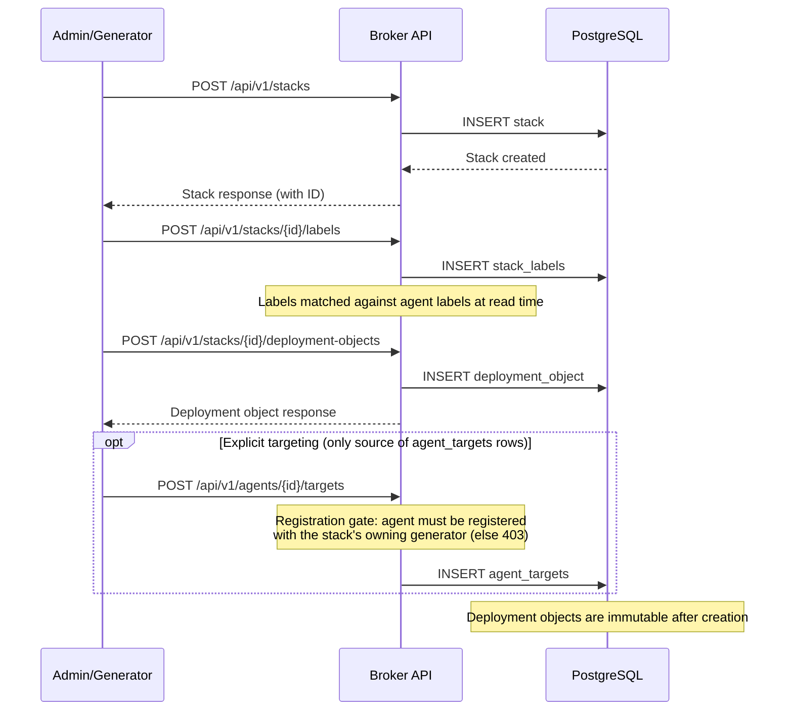
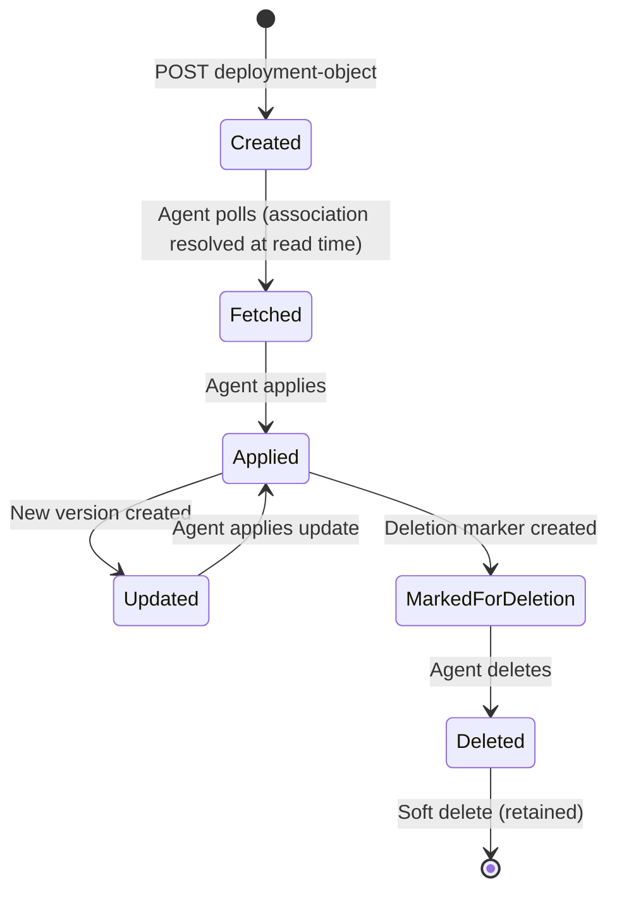
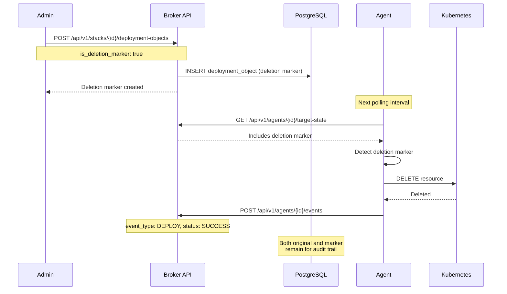
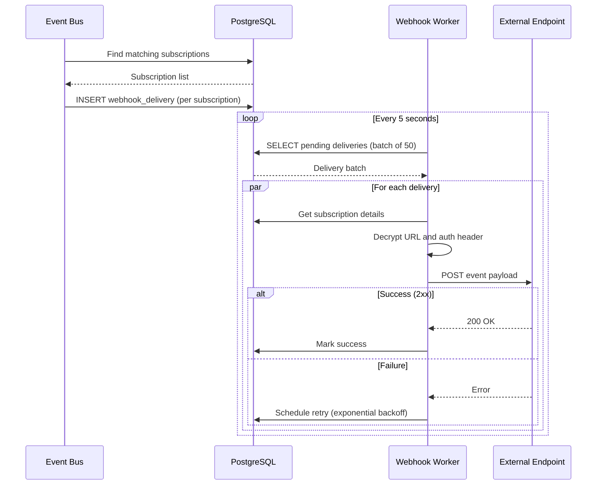
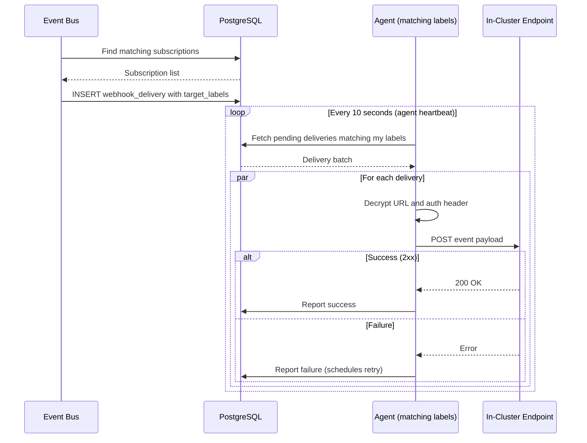
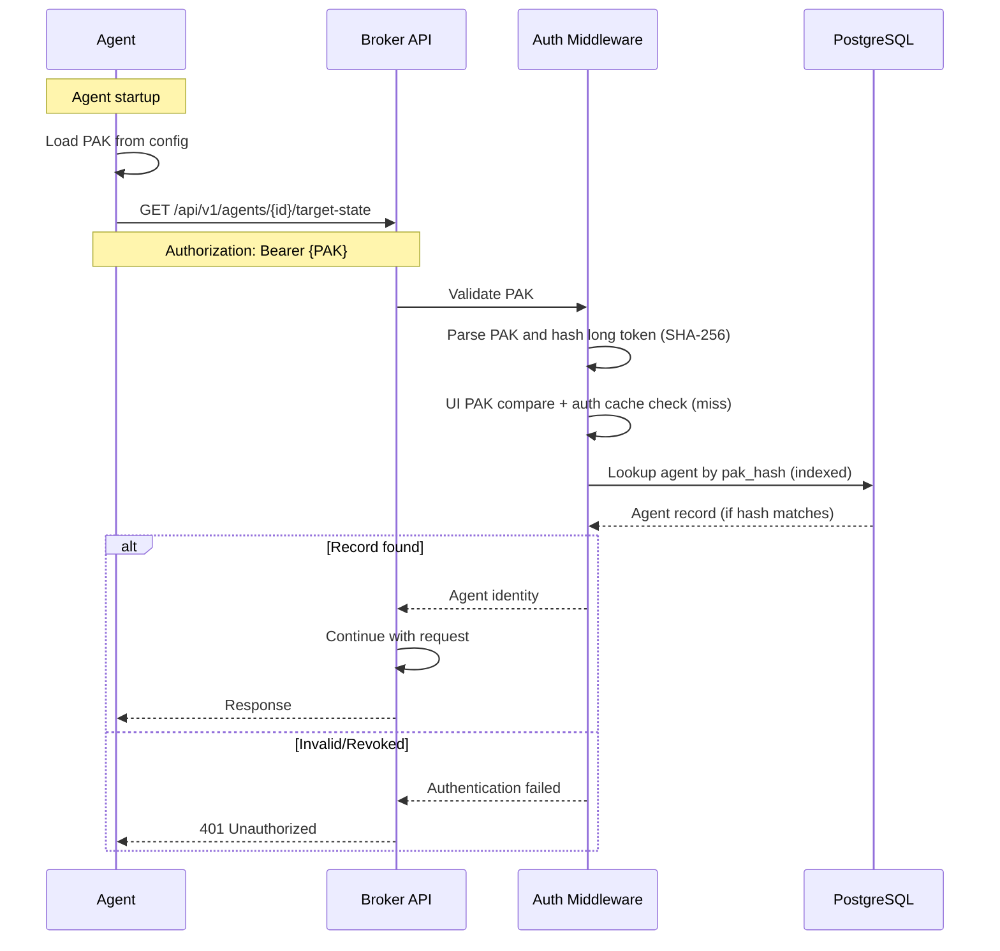
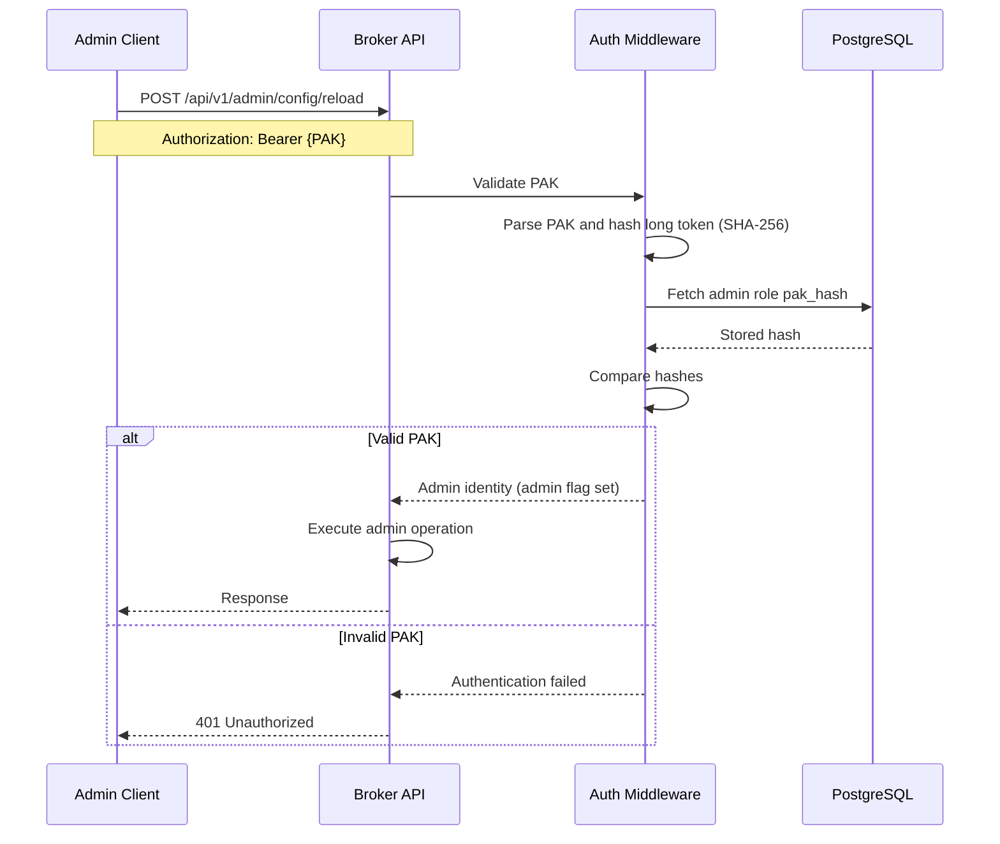
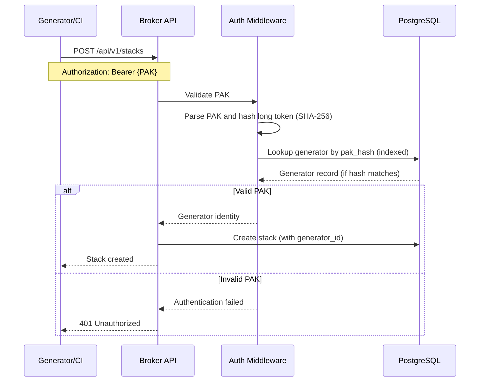
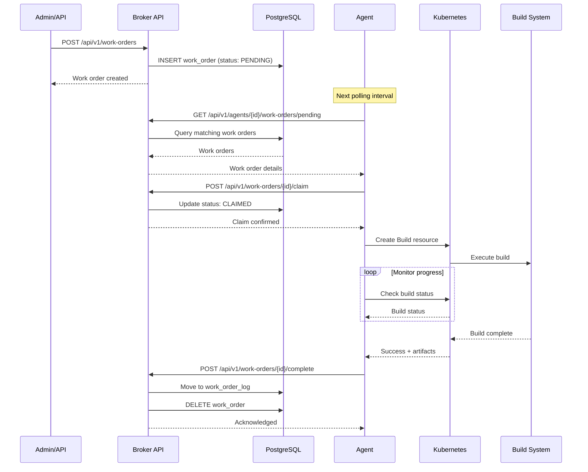

# Data Flows

This document traces the journey of data through the Brokkr system, from initial deployment creation through resource application in target clusters and event propagation to external systems. Understanding these flows is essential for debugging issues, optimizing performance, and building integrations with Brokkr.

## Deployment Lifecycle

The deployment lifecycle encompasses the complete journey of a deployment object from creation through application on target clusters. This flow demonstrates Brokkr's immutable, append-only data model and its approach to eventual consistency.

### Creating a Deployment

Deployments begin their lifecycle when an administrator or generator creates a stack and submits deployment objects to it. Creating a deployment object is a pure write: the broker stores the object and returns. No matching runs and no agent associations are written at creation time.



The broker assigns each deployment object a sequence ID upon creation, establishing a strict ordering that agents use to process updates in the correct sequence. This sequence ID is monotonically increasing within each stack, ensuring that newer deployment objects always have higher sequence IDs than older ones. The combination of stack ID and sequence ID provides a reliable mechanism for agents to track which objects they have already processed.

When a deployment object is created, the broker does not push it to agents, and it does not precompute which agents should receive it. The agent-to-stack association is resolved dynamically every time an agent polls: the broker unions the stacks explicitly targeted to the agent (rows in `agent_targets`, created only via `POST /api/v1/agents/{id}/targets`) with stacks that share *any* label with the agent and stacks that share *any* annotation key/value pair with the agent (OR semantics within each of those two legs). Deployment objects from that union form the agent's target state.

Registration constrains that union at both ends. On the write side, an `agent_targets` row can only be created — and an existing one only removed — when the agent is registered with the stack's owning generator; otherwise the broker rejects the mutation with a `403 agent_not_registered` (admins included, with no force override). On the read side, the label and annotation legs contribute only stacks whose owning generator the agent is registered with, so a matching label on an unregistered generator's stack yields nothing. Explicit targets need no read-time filter, having been checked when they were created. The effect is that matching selects *within* the scopes an agent consented to rather than reaching across them. See [Generator Registration and Application Scopes](security-model.md#generator-registration-and-application-scopes).

Every agent is auto-registered, at creation, with a built-in system generator (`__system__`) that the broker provisions at startup. That registration is what lets fleet- and system-scoped stacks reach every agent without an explicit opt-in. Beyond the system generator, an agent only sees an application's stacks once it is registered with that application's generator — either pre-registered when the agent is created or registered later. (The system generator is distinct from the admin generator; agents are not auto-registered with the latter.) The operational steps for registering and deregistering agents live in the [agent registration how-to](../how-to/agent-registration.md).

### Agent Reconciliation

Agents continuously poll the broker and reconcile their cluster state to match the desired state defined by deployment objects. The reconciliation loop runs at a configurable interval: the agent binary's own default is 10 seconds, and the Helm chart — the documented install path — sets its own default of 30 seconds, so chart-installed fleets observe the slower cadence unless it is overridden.

Which application-scoped stacks an agent is eligible to receive is shaped by the generator scopes it self-registers with at startup, resolved in precedence order (`--generator-ids` flag, then `BROKKR__AGENT__GENERATOR_IDS`, then the deprecated bare `BROKKR_GENERATOR_IDS`). An empty value leaves the agent in system/fleet scope only — it still receives system-scoped stacks regardless, because of the automatic system-generator registration. The configuration keys are documented under [`BROKKR__AGENT__GENERATOR_IDS`](../reference/environment-variables.md).

```mermaid
sequenceDiagram
    participant Agent as Agent
    participant Broker as Broker API
    participant DB as PostgreSQL
    participant K8s as Kubernetes API
    participant Cluster as Cluster State

    loop Every polling interval (binary default 10s; chart default 30s)
        Agent->>Broker: GET /api/v1/agents/{id}/target-state
        Broker->>DB: Resolve associated stacks (targets ∪ registered-generator label/annotation matches)
        Broker->>DB: Query their deployment objects
        DB-->>Broker: Deployment objects list
        Broker-->>Agent: Deployment objects (with sequence IDs)

        Agent->>Agent: Calculate diff (desired vs actual)

        alt New objects to apply
            Agent->>K8s: Apply resource (create/update)
            K8s->>Cluster: Resource created/updated
            K8s-->>Agent: Success/Failure
            Agent->>Broker: POST /api/v1/agents/{id}/events
            Broker->>DB: INSERT agent_event
        end

        alt Objects to delete (deletion markers)
            Agent->>K8s: Delete resource
            K8s->>Cluster: Resource deleted
            K8s-->>Agent: Success/Failure
            Agent->>Broker: POST /api/v1/agents/{id}/events
            Broker->>DB: INSERT agent_event
        end

        Agent->>Agent: Update local state cache
    end
```

The agent's `GET /api/v1/agents/{id}/target-state` endpoint returns deployment objects the agent is responsible for, filtered to exclude objects already deployed (based on agent events). This optimization reduces payload size and processing time for agents managing large numbers of deployments.

During reconciliation, the agent uses Kubernetes server-side apply to create or update resources. This approach preserves fields managed by other controllers while allowing the agent to manage its own fields. The agent orders resource application to respect dependencies: Namespaces and CustomResourceDefinitions are applied before resources that depend on them.

After each successful operation, the agent reports an event to the broker. These events serve multiple purposes: they update the broker's view of deployment state, they trigger webhook notifications to external systems, and they provide an audit trail of all operations.

### Deployment Object States

Deployment objects follow an implicit lifecycle tracked through their presence, associated agent events, and deletion markers. The state model uses soft deletion to maintain a complete audit trail while supporting reliable cleanup.



The states map to the diagram as follows. **Created** — the object exists in the database (which agents receive it is resolved at poll time, as described above). **Fetched** — at least one agent's poll resolved an association to the object's stack and received it. **Applied** — an agent applied the resource and reported a confirming event (recording the deployment object ID, timestamp, and outcome). **Updated** — a new object with a higher sequence ID supersedes it for the same logical resource, and the agent applies the update on its next reconcile. **MarkedForDeletion** — a deletion-marker object (a deployment object flagged to delete rather than apply) was created. **Deleted** — the agent removed the resource; both the original and the marker remain with `deleted_at` timestamps for audit.

### Deletion Flow

Deleting resources uses a marker pattern that ensures reliable cleanup even when agents are temporarily unavailable. Rather than immediately removing data, the broker creates a deletion marker that agents process during their normal reconciliation cycle.



This marker approach beats immediate deletion: offline agents process accumulated markers when they reconnect, the full history of what was deployed and removed is preserved, and rollback is possible by creating new deployment objects that restore deleted resources.

### Deregistration and Cascading

Deregistering an agent from a generator triggers a second cleanup path that complements the deletion-marker flow above. When an agent is removed from a generator's scope, the broker deletes every `agent_targets` row that pointed the agent at that generator's stacks and pushes a `TargetChanged` frame to the agent over its WebSocket connection. The agent prunes the now-unscoped resources on its next reconcile, so its served-stack set sheds the application atomically when its scope changes. This is the inverse of the registration gate on target creation: registration controls whether an explicit target can exist, and deregistration tears down the targets that registration once permitted. See [Generator Registration and Application Scopes](security-model.md#generator-registration-and-application-scopes) for the concept and the [agent registration how-to](../how-to/agent-registration.md) for the operational steps.

## Event Flow

Events form the nervous system of Brokkr, propagating state changes from agents through the broker to external systems. The event system handles agent reports, webhook notifications, and audit logging through an asynchronous architecture designed for high throughput and reliability.

### Event Architecture

The broker uses a database-centric approach to event emission. Rather than an in-memory pub/sub bus, events are directly matched against webhook subscriptions and inserted into the delivery queue. Audit logging operates independently through its own asynchronous channel.

```mermaid
flowchart LR
    subgraph Agent
        Apply[Apply Resource]
        Report[Event Reporter]
    end

    subgraph Broker
        API[API Handler]
        DB[(Database)]
        Emit[Event Emitter]
        Webhook[Webhook Worker]
        Audit[Audit Logger]
    end

    subgraph External
        Endpoints[Webhook Endpoints]
        Logs[Audit Logs]
    end

    Apply --> Report
    Report -->|POST /agents/{id}/events| API
    API --> DB
    API --> Emit
    Emit -->|Match subscriptions & insert deliveries| DB
    Webhook -->|Poll pending deliveries| DB
    Webhook --> Endpoints
    API --> Audit
    Audit --> Logs
```

When an event occurs, the `emit_event()` function queries the database for webhook subscriptions whose event type pattern matches the event. For each matching subscription, a delivery record is created in PENDING status. The webhook delivery worker then processes these records independently, ensuring webhook delivery doesn't block API responses.

Audit logging uses a separate asynchronous channel with a 10,000-entry buffer. A background writer task batches entries (up to 100 per batch or every 1 second) for efficient database writes.

### Agent Event Reporting

Agents report events to the broker after completing each operation. The `POST /api/v1/agents/{id}/events` endpoint accepts event data and persists it to the `agent_events` table.

Every event the agent emits today carries `event_type: "DEPLOY"`, with the outcome expressed in the `status` field. The broker validates that `status` is one of `SUCCESS` or `FAILURE`:

| event_type | status | Trigger | Data Included |
|------------|--------|---------|---------------|
| `DEPLOY` | `SUCCESS` | Resource(s) applied or deleted successfully | Deployment object ID, optional message |
| `DEPLOY` | `FAILURE` | Apply or delete operation failed | Deployment object ID, error message |

Each event references the deployment object it concerns and may carry a free-form message (for failures, the error description). This data enables tracking of deployment state and troubleshooting of failures.

Events are processed synchronously in the API handler—the database insert must succeed before the endpoint returns. However, downstream processing (webhook delivery, audit logging) happens asynchronously.

### Webhook Delivery

Webhook subscriptions enable external systems to receive notifications when events occur in Brokkr. The delivery system prioritizes reliability through persistent queuing and automatic retries, with two delivery modes for different network topologies.

#### Broker Delivery (Default)

When no `target_labels` are specified on a subscription, the broker delivers webhooks directly. This is suitable for external endpoints accessible from the broker's network.



The webhook worker runs as a background task, polling for pending deliveries every 5 seconds (configurable via `broker.webhook_delivery_interval_seconds`). Each polling cycle processes up to 50 deliveries (configurable via `broker.webhook_delivery_batch_size`), enabling high throughput while controlling resource usage.

#### Agent Delivery

When `target_labels` are specified on a subscription, agents matching those labels deliver the webhooks. This enables webhooks to reach in-cluster endpoints (e.g., `http://service.namespace.svc.cluster.local`) that the broker cannot access due to network separation.



Agent delivery requires the agent to have ALL labels specified in `target_labels`. For example, a subscription with `target_labels: ["env:prod", "region:us"]` will only be delivered by agents with both labels. This allows precise control over which agents handle which webhooks.

#### Encryption and Security

Delivery URLs and authentication headers are stored encrypted in the database using AES-256-GCM. The worker decrypts these values just before making the HTTP request, minimizing the time sensitive data exists in memory.

#### Retry Behavior

Failed deliveries are retried with exponential backoff. The first retry occurs after 2 seconds, the second after 4 seconds, then 8, 16, and so on. After exhausting the maximum retry count (configurable), deliveries are marked as "dead" and no longer retried. A cleanup task removes old delivery records after 7 days (configurable via `broker.webhook_cleanup_retention_days`).

### Event Types

Brokkr emits events for various system activities, enabling external systems to react to state changes.

| Category | Event Types | Description |
|----------|-------------|-------------|
| **Agent** | `agent.registered`, `agent.deregistered` | Agent lifecycle events |
| **Stack** | `stack.created`, `stack.deleted` | Stack lifecycle events |
| **Deployment** | `deployment.created`, `deployment.applied`, `deployment.failed`, `deployment.deleted` | Deployment object lifecycle and application results |
| **Work Order** | `workorder.created`, `workorder.claimed`, `workorder.completed`, `workorder.failed` | Work order lifecycle from creation to completion |

Webhook subscriptions can filter by event type using exact matches or wildcards (e.g., `deployment.*` matches all deployment events). This filtering reduces unnecessary network traffic and processing on the receiving end. See the [Webhooks Reference](../reference/webhooks.md) for complete details on event payloads and subscription configuration.

## Authentication Flows

All actors in Brokkr authenticate using Prefixed API Keys (PAKs) sent via the `Authorization: Bearer` header. The middleware resolves one of four identity classes. It first compares the presented PAK's hash against the ephemeral read-only UI PAK held in broker memory (a constant-time, database-free check that authenticates the operator console), then consults a short-lived auth cache of recent verifications, and only on a cache miss checks three tables in order—admin roles, agents, and generators—to determine the identity type.

### PAK Authentication

Prefixed API Keys (PAKs) provide secure, stateless authentication for agents. The PAK contains both an identifier and a secret component, enabling the broker to authenticate requests without storing plaintext secrets.



PAK structure follows a defined format: `brokkr_BR{short_token}_{long_token}`. The short token serves as an identifier that can be safely logged and displayed. The long token is the secret component—it is hashed with SHA-256 before storage, and the plaintext is never persisted.

When an agent authenticates, the middleware hashes the presented PAK's long token with SHA-256, rules out the in-memory UI PAK with a constant-time compare, and checks the auth cache (TTL configurable via `broker.auth_cache_ttl_seconds`, default 60 seconds; 0 disables it). On a cache miss it looks the hash up directly in the indexed `pak_hash` column (checking the admin role first, then agents, then generators) and caches a successful result. A request authenticates if and only if a live record with that hash exists — or the hash matches the process's UI PAK, which yields a read-only admin identity for the operator console (see the [Security Model](./security-model.md#read-only-console-authentication-the-ui-pak)).

PAKs can be rotated through the `POST /api/v1/agents/{id}/rotate-pak` endpoint, which generates a new PAK and invalidates the previous one. The new PAK is returned only once—it cannot be retrieved later.

### Admin Authentication

Administrators authenticate using PAKs stored in the `admin_role` table. Admin PAKs grant access to sensitive management operations that regular agents and generators cannot perform.



Admin PAKs enable access to sensitive operations including configuration reload, audit log queries, agent management, and system health endpoints. The PAK is verified using the same mechanism as agent authentication—SHA-256 hashing of the long token and lookup against the stored hash.

### Generator Authentication

Generators, typically CI/CD systems, authenticate using PAKs just like agents and admins. These keys enable automated deployment workflows while maintaining security boundaries.



Generators can create and manage stacks and deployment objects, but they cannot access admin endpoints or manage other generators. Resources created by a generator are associated with its identity, enabling audit tracking and future access control enhancements.

## Work Order Flow

Work orders enable the broker to dispatch tasks to agents for execution. Unlike deployment objects which represent desired state, work orders represent one-time operations like container image builds or diagnostic commands.



Work orders support sophisticated targeting through three mechanisms: hard targets (specific agent IDs), label matching (agents with matching labels), and annotation matching (agents with matching annotations). An agent is eligible to claim a work order if it matches any of these criteria.

The claiming mechanism prevents multiple agents from processing the same work order. When an agent claims a work order, the broker atomically updates its status to CLAIMED and records the claiming agent's ID. If the claim succeeds, the agent proceeds with execution; if another agent already claimed it, the claim fails.

### Work Order States

Work orders transition through a defined set of states, with automatic retry handling for transient failures.

| State | Description | Transitions To |
|-------|-------------|----------------|
| **PENDING** | Awaiting claim by an agent | CLAIMED |
| **CLAIMED** | Agent is processing | SUCCESS (to log), RETRY_PENDING |
| **RETRY_PENDING** | Scheduled for retry after failure | PENDING (after backoff) |

Successful completion moves the work order to the `work_order_log` table and deletes the original record. This design keeps the active work order table small while maintaining a complete history of completed operations.

Failed work orders may be retried depending on configuration. When a retryable failure occurs, the work order enters RETRY_PENDING status with a scheduled retry time based on exponential backoff. A background task runs every 10 seconds, resetting RETRY_PENDING work orders to PENDING once their retry time has elapsed.

Stale claims are automatically detected and reset. If an agent claims a work order but fails to complete it within the configured timeout (due to crash or network partition), the broker resets the work order to PENDING, allowing another agent to claim it.

## Data Retention

Brokkr keeps different classes of data for very different lengths of time, and by two different mechanisms. Understanding which mechanism applies to a table tells you whether old data is merely hidden or actually gone.

### Immutability Pattern

As established above, deployment objects are append-only: updates create new objects with higher sequence IDs and deletions create markers, so nothing is mutated in place.

The `deleted_at` timestamp implements soft deletion across most entity types. Queries filter by `deleted_at IS NULL` by default, hiding deleted records from normal operations while preserving them for auditing. Special "include deleted" query variants provide access to the full history when needed.

Soft deletion is a *visibility* mechanism, not a retention mechanism. Rows marked `deleted_at` still occupy storage indefinitely. Tables that would otherwise grow without bound are additionally subject to a background eviction task that issues real `DELETE` statements — those rows are unrecoverable once the window passes, whether or not they were ever soft-deleted.

### Retention Policies

| Data Type | Default Retention | Cleanup Method |
|-----------|-------------------|----------------|
| Deployment objects | Indefinite | Soft delete only — no eviction |
| Agent events | 30 days (`broker.agent_events_retention_days`; set to `0` to keep indefinitely) | Hourly hard-delete task |
| Webhook deliveries | 7 days (`broker.webhook_cleanup_retention_days`) | Hourly hard-delete task |
| Audit logs | 90 days (`broker.audit_log_retention_days`) | Daily hard-delete task |
| Diagnostic requests and results | 1 hour (`broker.diagnostic_max_age_hours`) | Hard-delete task every 15 minutes |
| Streamed Kubernetes events and pod logs | 6 hours (hard ceiling, not configurable upward) | Continuous eviction, every 60 seconds |

Deployment objects are the only class with no eviction at all — they are the system's record of what was deployed, so they are kept indefinitely and only soft-deleted.

Agent events are evicted on an hourly sweep that hard-deletes every row whose server-side `created_at` is older than the window. This matters for anyone treating the agent event stream as a durable deployment history: by default, events older than thirty days are gone from the database, not merely hidden. The window is configurable, and setting it to `0` disables eviction entirely at the cost of unbounded table growth at fleet scale. Eviction keys off the broker's own ingestion timestamp rather than any timestamp supplied by the agent, so a misbehaving agent cannot backdate events to keep them alive past the window.

Audit logs and webhook deliveries follow the same pattern on longer and shorter windows respectively. Diagnostic results are the shortest-lived of the request-scoped data, since they capture point-in-time debugging snapshots that lose value quickly; their cleanup task also expires unclaimed diagnostic requests past their `expires_at`.

### Telemetry Is Not a Log Store

The streamed Kubernetes events and pod logs that reach the broker over the agent WebSocket channel are governed by a deliberately different rule: a **hard six-hour ceiling** that cannot be raised. A shorter window can be configured; a longer one cannot — any larger value is silently clamped back to six hours.

This is a product stance, not an implementation limit. These buffers exist to support immediate operational work — watching a rollout, reading the events behind a crash loop that is happening right now — and nothing else. Brokkr is explicitly not a log aggregation or long-term log retention system, and it should not be positioned as one or made the system of record for logs. Ship logs to a purpose-built platform for anything that must be queryable tomorrow; treat what Brokkr holds as a live tail that will be gone by the end of the shift.

Eviction here runs continuously rather than on a long interval — a sweep every sixty seconds — so the ceiling is enforced closely rather than approximately, and it keys off the broker's ingestion timestamp for the same reason agent-event eviction does.

### Incremental Target-State Filtering

Agents do not track sequence IDs or request "objects newer than X"—there is no such request parameter. Instead, the broker filters server-side using the agent's own event history. The `GET /api/v1/agents/{id}/target-state` endpoint accepts a `mode` query parameter: in the default `incremental` mode, the broker excludes deployment objects for which the agent has already recorded an agent event (i.e., objects it has already deployed); `mode=full` returns everything, including already-deployed objects.

Sequence IDs still matter for ordering: each deployment object carries a monotonically increasing sequence ID within its stack, and the broker returns target state sorted by sequence ID, so agents process updates in a well-defined order. When an agent reconnects after downtime, the incremental filter naturally surfaces exactly the objects it has not yet reported events for, ensuring reliable delivery while minimizing payload size.
