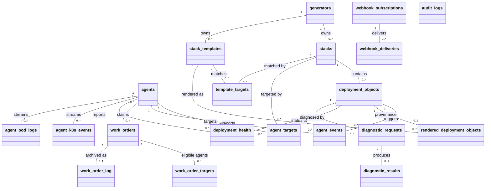
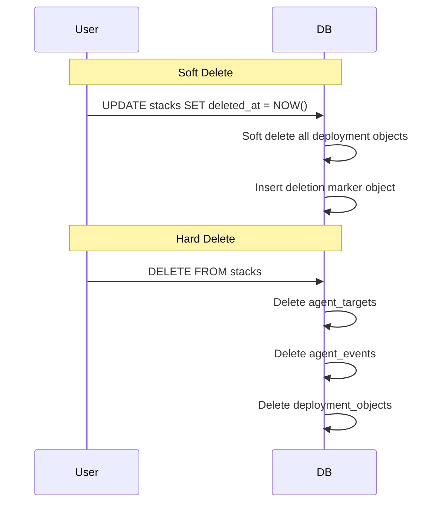

# Data Model Design

This document explains the design decisions and architectural philosophy behind Brokkr's data model.

## Entity Relationship Overview

Labels and annotations are omitted from the diagram for legibility: stacks, agents, templates, and work orders each have their own `*_labels` (single string values) and `*_annotations` (key-value pairs) tables. `audit_logs` stands alone — it records actor/action/resource tuples without foreign keys, so rows survive the deletion of what they describe. `agent_k8s_events` and `agent_pod_logs` are short-lived telemetry buffers evicted on a 6-hour ceiling, not part of the relational core.

## Design Philosophy

### Immutability of Deployment Objects

Deployment objects are immutable after creation (except for soft deletion). This design decision ensures:
- **Audit Trail**: Every deployment can be traced back to its exact configuration
- **Rollback Capability**: Previous configurations are always available
- **Consistency**: No accidental modifications to deployed resources

### Soft Deletion Strategy

All primary entities support soft deletion via `deleted_at` timestamps. This approach provides:
- **Recovery**: Accidentally deleted items can be restored
- **Referential Integrity**: Related data remains intact
- **Historical Analysis**: Past configurations and relationships are preserved
- **Compliance**: Audit requirements are met without data loss

### Cascading Operations

The system implements intelligent cascading for both soft and hard deletes:

#### Soft Delete Cascades
- Generator → Stacks and Deployment Objects
- Stack → Deployment Objects (with deletion marker)
- Agent → Agent Events

#### Hard Delete Cascades
- Stack → Agent Targets, Agent Events, Deployment Objects
- Agent → Agent Targets, Agent Events
- Generator → (handled by foreign key constraints)

## Key Architectural Decisions

### Why Generators?

Generators represent external systems that create stacks and deployment objects. This abstraction:
- Provides authentication boundaries for automated systems
- Tracks which system created which resources
- Enables rate limiting and access control per generator
- Maintains audit trail of automated deployments

### Why Agent Targets?

The many-to-many relationship between agents and stacks enables:
- Flexible deployment topologies
- Multi-cluster deployments
- Gradual rollouts
- Environment-specific targeting

### Labels vs Annotations

**Labels** (single values):
- Used for selection and filtering
- Simple categorization
- Fast queries

**Annotations** (key-value pairs):
- Rich metadata
- Configuration hints
- Integration with external systems

## Trigger Behavior

### Stack Deletion Flow

### Deployment Object Protection

Deployment objects cannot be modified except for:
- Setting `deleted_at` (soft delete)
- Updating deletion markers

This is enforced by database triggers to ensure immutability.

## Performance Considerations

### Indexing Strategy

Key indexes are created on:
- Foreign keys for join performance
- `deleted_at` for filtering active records
- Unique constraints for data integrity
- Frequently queried fields (name, status)

### Sequence IDs

Deployment objects use `BIGSERIAL sequence_id` for:
- Guaranteed ordering
- Efficient pagination
- Conflict-free concurrent inserts

## Migration Strategy

The data model is managed through versioned SQL migrations in `crates/brokkr-models/migrations/`. Each migration:
- Is idempotent
- Includes both up and down scripts
- Is tested in CI/CD pipeline

For detailed field definitions and constraints, refer to the [API documentation](../reference/api/README.md) or the source code in `crates/brokkr-models/`.
