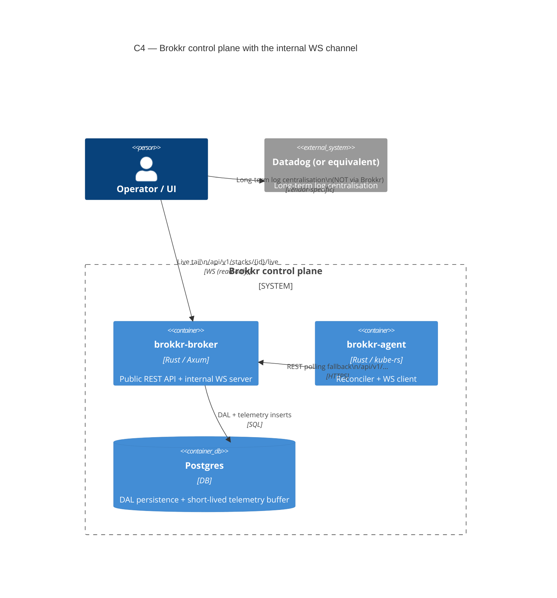

# Internal Broker ↔ Agent WebSocket Channel

> **Scope:** internal architecture — operators only. The agent and broker
> talk to each other over a private WebSocket on top of the existing
> REST surface. External SDK consumers continue to use REST exclusively;
> this channel is not part of the public OpenAPI contract.

The full design rationale is in [ADR-0008]. This page documents the
operational shape: what flows where, what's configurable, and what the
**6-hour telemetry retention ceiling** means for log/event data.

[ADR-0008]: https://github.com/colliery-io/brokkr/blob/main/.metis/adrs/BROKKR-A-0008.md

## Container view



> *The diagram shows the default **single-ingress** topology: the agent's WS
> and REST traffic both reach the broker over one path. Setting the agent's
> `ws_url` (see [Configuration](#when-to-use-ws_url-split-ws--rest-ingress))
> enables a **split-ingress** variant where the `Internal WS` edge terminates
> on a different ingress / load balancer than `REST polling fallback`; the two
> broker-facing edges above would then enter via separate ingresses.*

The agent always opens **one** WebSocket connection to the broker. While
that connection is up, the following traffic moves over it:

| Direction        | Frame variant      | Replaces / supplements REST                           |
| ---------------- | ------------------ | ------------------------------------------------------ |
| Broker → Agent   | `work_order`       | Replaces work-order polling for explicitly-targeted agents |
| Broker → Agent   | `target_changed`   | Replaces target-add polling latency                    |
| Broker → Agent   | `stack_changed`    | Replaces stack-mutation polling latency                |
| Agent → Broker   | `heartbeat`        | Replaces `POST /agents/{id}/heartbeat`                 |
| Agent → Broker   | `agent_event`      | Replaces `POST /agents/{id}/events`                    |
| Agent → Broker   | `agent_health`     | Replaces `PATCH /agents/{id}/health-status`            |
| Agent → Broker   | `k8s_event`        | New — see "Telemetry track" below                      |
| Agent → Broker   | `pod_log_line`     | New — see "Telemetry track" below                      |
| Agent → Broker   | `log_gap`          | New — gap marker for dropped log lines                 |

When the WebSocket drops, the agent transparently falls back to REST for
all of the above. The control plane is **never** lost — the WS channel
is an optimisation layer over REST, not a replacement.

## Configuration

The single user-facing knob is in the agent's config:

```toml
[agent]
# Default: WS on, REST polling as fallback. Per ADR-0008.
ws_force_rest = false
```

`ws_force_rest = true` exists for restricted environments (no WS through
ingress) and for debugging the REST fallback path in isolation: the agent
**never** opens a WebSocket — the state pins at `ForceRestOnly` and every
emitter short-circuits to REST. The knob is cataloged in the
[Environment Variables Reference](../reference/environment-variables.md).

There is no broker-side opt-out: the broker always serves
`/internal/ws/agent`. Operators that want to keep agents off WS for
infrastructure reasons (e.g. an ingress that doesn't proxy upgrades)
should set `ws_force_rest = true` on each agent.

### When to use `ws_url` (split WS / REST ingress)

By default the agent derives its WebSocket endpoint from `broker_url`
(`http`→`ws`, `https`→`wss`, with `/internal/ws/agent` appended). WS and
REST therefore share one ingress, which is correct for almost every
deployment. The optional `ws_url` agent setting overrides **only** the WS
endpoint:

```toml
[agent]
# Leave unset to derive from broker_url. Set only for a split ingress.
ws_url = "wss://ws.brokkr.example.com/internal/ws/agent"
```

(Helm: `agent.wsUrl`, which maps to `BROKKR__AGENT__WS_URL`. REST still
follows `broker.url`.)

Reach for it only when WS traffic must traverse a **different ingress /
load balancer than REST**. Real cases:

- A WS-aware LB with sticky sessions in front of WS, while REST goes
  through a plain ALB — AWS ALBs support WebSockets but their idle
  timeouts are aggressive, so a dedicated NLB / longer-timeout path for WS
  is sometimes preferable.
- Different SSL-termination policy for the long-lived WS connection.
- A separate ingress controller for streaming traffic so a noisy REST
  burst can't starve WS upgrades.

The URL must be a full `ws://host:port/internal/ws/agent` (or `wss://`).
The agent gates on `ws_url` when set and falls back to deriving from
`broker_url` otherwise — see [ADR-0008](https://github.com/colliery-io/brokkr/blob/main/.metis/adrs/BROKKR-A-0008.md) (the WS-channel decision record)
for the invariant.

### Tuning the kube-events UID cache (large clusters)

The agent's kube-events tailer (WS-07) does one dynamic-API lookup per
*new* object UID to decide whether an Event belongs to a Brokkr-managed
object, then caches the answer. The cache is a bounded LRU (default
**10 000** entries, 5-minute TTL) so a cluster with high churn of
unmanaged objects can't grow it without limit. The capacity is
`agent.kube_event_uid_cache_cap` (default 10 000, sized for roughly 10k
managed pods; see the [Environment Variables Reference](../reference/environment-variables.md)).

The default suits clusters up to ~10k managed pods. Bump it for larger
fleets; the trade-off is agent memory versus how often an evicted entry
forces a fresh API lookup the next time that object emits an Event. The
cap bounds memory, not correctness — an evicted entry just costs one more
lookup.

## Telemetry track — short-lived buffer, not a log store

Brokkr streams Kubernetes Events and pod logs for objects an agent
manages, persists them, and lets a consumer (such as the `ui-slim`
demo) tail them live. **It is not a log warehouse.** A hard 6-hour retention ceiling is enforced in-process
by a continuous eviction worker. There is no user-facing retention
setting: the window is fixed at the 6-hour ceiling and cannot be
shortened or extended through configuration.

| Concern                        | Decision                                                                                                                  |
| ------------------------------ | ------------------------------------------------------------------------------------------------------------------------- |
| Retention ceiling              | **6 hours**, fixed — not user-configurable in either direction (`ws::eviction::HARD_RETENTION_CEILING`)                  |
| Eviction cadence               | Continuous (default 60s tick); not lazy-on-read                                                                          |
| Eviction key                   | Server-side `created_at`, not the agent's timestamp — backdated frames cannot extend retention                            |
| Log opt-in granularity         | Per-pod annotation `brokkr.io/stream-logs: "true"` (set on the pod template). Off by default.                          |
| Kube Events opt-in             | Always-on for managed objects (Events are cheap signal)                                                                  |
| Rate limit                     | 100 lines/sec per container by default; over-rate lines drop with a `LogGap{RateLimit}` marker                            |
| Long-term log centralisation   | **Use Datadog** (or equivalent). Brokkr will not grow into that role.                                                    |

If a stack needs more than 6 hours of log history, the answer is "ship it
to a dedicated log platform (e.g. Datadog)", not "raise the ceiling". The
6h limit is a product invariant recorded in [ADR-0008](https://github.com/colliery-io/brokkr/blob/main/.metis/adrs/BROKKR-A-0008.md).

## Endpoints

The full endpoint catalog — the internal `/internal/ws/agent` upgrade,
the public history endpoints (`/api/v1/stacks/{id}/events`, `/logs`),
the live-tail upgrade (`/api/v1/stacks/{id}/live`), and the admin
connection snapshot — is documented in the
[WebSocket Protocol reference](../reference/ws-protocol.md).

Every history-endpoint response carries a `retention` object that calls
out the ceiling, the effective retention, the oldest available timestamp,
and a `long_term_sink_hint` pointing at Datadog. UI and SDK consumers
should surface this rather than hiding it.

## Observability (Prometheus)

All WS-channel metrics are exposed under the existing `/metrics` scrape
endpoint; the catalog lives in the
[Monitoring reference](../reference/monitoring.md#websocket-channel-metrics).

Counters intentionally avoid per-agent / per-stack labels to keep
cardinality bounded. Per-agent visibility lives in
`GET /api/v1/admin/ws/connections`.

### Dashboard + alert

A ready-to-import Grafana dashboard and a Prometheus alert rule ship with
the repo:

- **Dashboard**: `docs/grafana/brokkr-ws-channel-dashboard.json` (uid
  `brokkr-ws-channel`). Panels: connected agents, live subscribers, WS
  message rate by `direction · type`, eviction-worker liveness, and rows
  evicted by table. Import steps are in
  [Setting Up Monitoring](../how-to/monitoring-setup.md#import-grafana-dashboards).
- **Alert**: `docs/grafana/brokkr-ws-channel.rules.yml` —
  `BrokkrWsEvictionWorkerStalled` fires (severity `warning`) when
  `brokkr_ws_log_eviction_runs_total` stops incrementing for >10m, i.e. the
  6h retention worker has died and the telemetry tables are about to grow
  unbounded. This is the one WS failure mode that is otherwise silent.

## Operating notes

### Ingress / proxy timeouts

The internal WS connection and the live-tail subscription are
**long-lived** — they only close on agent crash, broker restart,
explicit client close, or credential revocation (see below). Ingress
controllers / reverse proxies in front of the broker must therefore
tolerate idle WebSocket connections. Concrete settings for
nginx-ingress, Traefik, and AWS ALB are in the
[Network Configuration how-to](../how-to/network-configuration.md#websocket-timeouts).

### Recovery semantics

- Agent reconnect: exponential backoff 1s → 60s, ±20% jitter, reset on success.
- Broker restart: existing agents reconnect under their own backoff; no
  data loss because the REST polling fallback always covers any window
  during which WS is down.
- Subscriber lag: when a live-tail subscriber falls behind the
  per-stack buffer (1024 frames), the broker delivers a
  `log_gap{reason: BufferFull, dropped_count}` so a consumer renders a
  visible gap rather than silently dropping data.

### Credential revocation closes the socket

PAK authentication is checked once, at WS upgrade. To prevent a revoked
credential from continuing to stream on an already-open socket, the broker
**force-closes an agent's WS connection the moment its PAK is invalidated**:

- **Rotating an agent's PAK** (`POST /api/v1/agents/{id}/rotate-pak`) closes
  the old connection immediately after the new PAK is committed.
- **Deleting an agent** (`DELETE /api/v1/agents/{id}`) closes its connection.

The teardown happens after the database commit, so it never races the
write. The agent will attempt to reconnect under its normal backoff; that
reconnect re-checks the (now-invalid) PAK and is rejected with `401`, which
is the intended end state for an incident-response "rotate the agent
credential" workflow. There is no data loss: REST polling remains the source
of truth and covers any window during which WS is down.

### Browser live tail (subprotocol auth)

The live-tail subscription (`/api/v1/stacks/{id}/live`) is consumable
directly from a browser. Because the browser `WebSocket` API can't set an
`Authorization` header, the PAK rides in `Sec-WebSocket-Protocol`:

```js
new WebSocket(liveUrl, ["brokkr.v1", `brokkr.pak.${pak}`]);
```

The broker lifts the PAK out of the `brokkr.pak.` subprotocol into the
normal auth path and echoes back only the non-secret `brokkr.v1` marker.
This is additive: clients that can set headers (agents, SDKs, the Node
`ws` package) keep using `Authorization: Bearer` unchanged — the
subprotocol PAK is consulted only when no auth header is present. See the
"Browser WS auth" amendment in [ADR-0008](https://github.com/colliery-io/brokkr/blob/main/.metis/adrs/BROKKR-A-0008.md). The `ui-slim` demo's Telemetry panel uses
this for its **Go Live** toggle, streaming `k8s_event` / `pod_log_line`
frames (and rendering `log_gap` markers) into the same events/logs tabs —
one illustration of what a consumer can build on the stream.

### When NOT to use the live tail

The live subscription is meant for short-duration operational
investigation (debugging a deploy that just happened, watching a
rollout). It is not meant for permanent log shipping. If you find
yourself wanting a long-running subscription, that's a sign the workload
should be shipping to Datadog directly.
