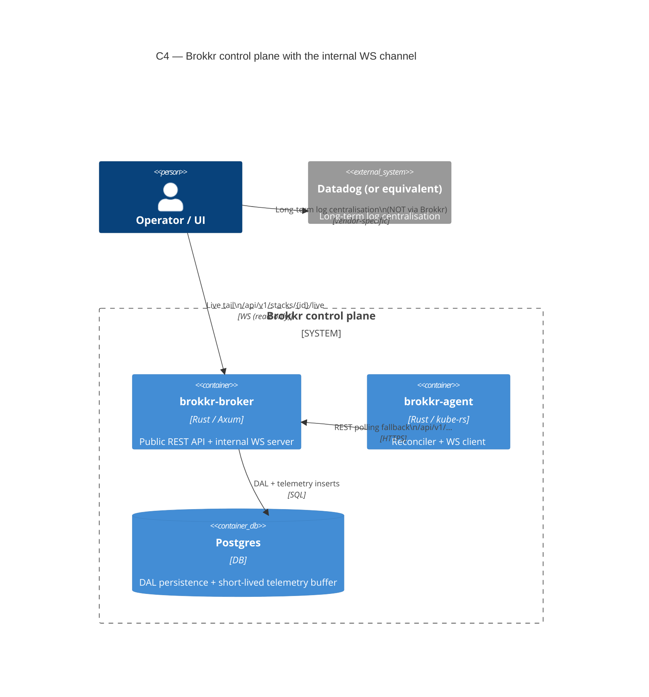

# Internal Broker ↔ Agent WebSocket Channel

> **Scope:** internal architecture — operators only. The agent and broker
> talk to each other over a private WebSocket on top of the existing
> REST surface. External SDK consumers continue to use REST exclusively;
> this channel is not part of the public OpenAPI contract.

The full design rationale is in [ADR-0008]. This page documents the
operational shape: what flows where, what's configurable, and what the
**6-hour telemetry retention ceiling** means for log/event data.

[ADR-0008]: https://github.com/colliery-io/brokkr/blob/main/.metis/adrs/BROKKR-A-0008.md

## Container view



The agent always opens **one** WebSocket connection to the broker. While
that connection is up, the following traffic moves over it:

| Direction        | Frame variant      | Replaces / supplements REST                           |
| ---------------- | ------------------ | ------------------------------------------------------ |
| Broker → Agent   | `work_order`       | Replaces work-order polling for explicitly-targeted agents |
| Broker → Agent   | `target_changed`   | Replaces target-add polling latency                    |
| Broker → Agent   | `stack_changed`    | Replaces stack-mutation polling latency                |
| Agent → Broker   | `heartbeat`        | Replaces `POST /agents/{id}/heartbeat`                 |
| Agent → Broker   | `agent_event`      | Replaces `POST /agents/{id}/events`                    |
| Agent → Broker   | `agent_health`     | Replaces `POST /agents/{id}/health`                    |
| Agent → Broker   | `k8s_event`        | New — see "Telemetry track" below                      |
| Agent → Broker   | `pod_log_line`     | New — see "Telemetry track" below                      |
| Agent → Broker   | `log_gap`          | New — gap marker for dropped log lines                 |

When the WebSocket drops, the agent transparently falls back to REST for
all of the above. The control plane is **never** lost — the WS channel
is an optimisation layer over REST, not a replacement.

## Configuration

The single user-facing knob is in the agent's config:

```toml
[agent]
# Default: WS on, REST polling as fallback. Per ADR-0008.
ws_force_rest = false
```

Set `ws_force_rest = true` for restricted environments (no WS through
ingress) or for debugging the REST fallback path in isolation. In this
mode the agent **never** opens a WebSocket — the state pins at
`ForceRestOnly` and every emitter short-circuits to REST.

There is no broker-side opt-out: the broker always serves
`/internal/ws/agent`. Operators that want to keep agents off WS for
infrastructure reasons (e.g. an ingress that doesn't proxy upgrades)
should set `ws_force_rest = true` on each agent.

## Telemetry track — short-lived buffer, not a log store

Brokkr streams Kubernetes Events and pod logs for objects an agent
manages, persists them, and lets the UI tail them live. **It is not a
log warehouse.** A hard 6-hour retention ceiling is enforced in-process
by a continuous eviction worker; per-stack config can shorten the window
but never extend it.

| Concern                        | Decision                                                                                                                  |
| ------------------------------ | ------------------------------------------------------------------------------------------------------------------------- |
| Retention ceiling              | **6 hours**, never configurable upward (`ws::eviction::HARD_RETENTION_CEILING`)                                          |
| Eviction cadence               | Continuous (default 60s tick); not lazy-on-read                                                                          |
| Eviction key                   | Server-side `created_at`, not the agent's timestamp — backdated frames cannot extend retention                            |
| Log opt-in granularity         | Per-pod annotation `brokkr.io/stream-logs: "true"` (set on the pod template). Off by default.                          |
| Kube Events opt-in             | Always-on for managed objects (Events are cheap signal)                                                                  |
| Rate limit                     | 100 lines/sec per container by default; over-rate lines drop with a `LogGap{RateLimit}` marker                            |
| Long-term log centralisation   | **Use Datadog** (or equivalent). Brokkr will not grow into that role.                                                    |

If a stack needs more than 6 hours of log history, the answer is "ship to
Datadog", not "raise the ceiling". The 6h limit is a product invariant
captured in the [project_log_retention_stance] memory and ADR-0008.

[project_log_retention_stance]: https://github.com/colliery-io/brokkr/blob/main/.metis/

## Endpoints

### Internal (not in OpenAPI)

| Path                            | Method | Auth        | Notes                                                              |
| ------------------------------- | ------ | ----------- | ------------------------------------------------------------------ |
| `/internal/ws/agent`            | GET    | Agent PAK   | WebSocket upgrade. Admin/generator PAKs → 403.                     |

### Public REST + WS (in OpenAPI, generated into all three SDKs)

| Path                                       | Method | Auth                  | Notes                                                                                  |
| ------------------------------------------ | ------ | --------------------- | -------------------------------------------------------------------------------------- |
| `/api/v1/stacks/{id}/events`               | GET    | Admin / owning gen    | Paginated kube-event history within the 6h window                                      |
| `/api/v1/stacks/{id}/logs`                 | GET    | Admin / owning gen    | Paginated pod-log history within the 6h window                                          |
| `/api/v1/stacks/{id}/live`                 | GET    | Admin / owning gen    | WebSocket upgrade for live event+log tail. Lagged subscribers see `log_gap` frames.   |
| `/api/v1/admin/ws/connections`             | GET    | Admin                 | Snapshot of currently-connected agents and aggregate live-subscriber count            |

Every history-endpoint response carries a `retention` object that calls
out the ceiling, the effective retention, the oldest available timestamp,
and a `long_term_sink_hint` pointing at Datadog. UI and SDK consumers
should surface this rather than hiding it.

## Observability (Prometheus)

All metrics exposed under the existing `/metrics` scrape endpoint:

| Metric                                                | Type          | Notes                                                            |
| ----------------------------------------------------- | ------------- | ---------------------------------------------------------------- |
| `brokkr_ws_connected_agents`                          | gauge         | Currently-connected agents on the internal channel               |
| `brokkr_ws_messages_total{direction, type}`           | counter       | `direction ∈ {in, out}`, `type` = wire enum tag                  |
| `brokkr_ws_live_subscribers`                          | gauge         | Live fan-out subscribers across all stacks                       |
| `brokkr_ws_log_eviction_runs_total`                   | counter       | Eviction passes executed                                          |
| `brokkr_ws_telemetry_evicted_total{table}`            | counter       | Rows evicted by table (`agent_k8s_events`, `agent_pod_logs`)     |

Counters intentionally avoid per-agent / per-stack labels to keep
cardinality bounded. Per-agent visibility lives in
`GET /api/v1/admin/ws/connections`.

## Operating notes

### Ingress / proxy timeouts

The internal WS connection and the live-tail subscription are
**long-lived** — they only close on agent crash, broker restart,
explicit client close, or credential revocation (see below). Ingress
controllers / reverse proxies in front
of the broker should be configured to allow idle WebSocket connections
for at least 5 minutes (anything longer is fine; the broker has no idle
timeout of its own).

Specific guidance:

- **nginx-ingress**: `nginx.ingress.kubernetes.io/proxy-read-timeout: "3600"`
  and `proxy-send-timeout` on the broker service.
- **Traefik**: defaults are usually fine; bump `transport.respondingTimeouts`
  if you see cuts at 60s.
- **AWS ALB**: increase the idle timeout on the listener (default 60s
  is too aggressive).

### Recovery semantics

- Agent reconnect: exponential backoff 1s → 60s, ±20% jitter, reset on success.
- Broker restart: existing agents reconnect under their own backoff; no
  data loss because the REST polling fallback always covers any window
  during which WS is down.
- Subscriber lag: when a live-tail subscriber falls behind the
  per-stack buffer (1024 frames), the broker delivers a
  `log_gap{reason: BufferFull, dropped_count}` so the UI renders a
  visible gap rather than silently dropping data.

### Credential revocation closes the socket

PAK authentication is checked once, at WS upgrade. To prevent a revoked
credential from continuing to stream on an already-open socket, the broker
**force-closes an agent's WS connection the moment its PAK is invalidated**:

- **Rotating an agent's PAK** (`POST /api/v1/agents/{id}/rotate-pak`) closes
  the old connection immediately after the new PAK is committed.
- **Deleting an agent** (`DELETE /api/v1/agents/{id}`) closes its connection.

The teardown happens after the database commit, so it never races the
write. The agent will attempt to reconnect under its normal backoff; that
reconnect re-checks the (now-invalid) PAK and is rejected with `401`, which
is the intended end state for an incident-response "rotate the agent
credential" workflow. There is no data loss: REST polling remains the source
of truth and covers any window during which WS is down.

### When NOT to use the live tail

The live subscription is meant for short-duration operational
investigation (debugging a deploy that just happened, watching a
rollout). It is not meant for permanent log shipping. If you find
yourself wanting a long-running subscription, that's a sign the workload
should be shipping to Datadog directly.
