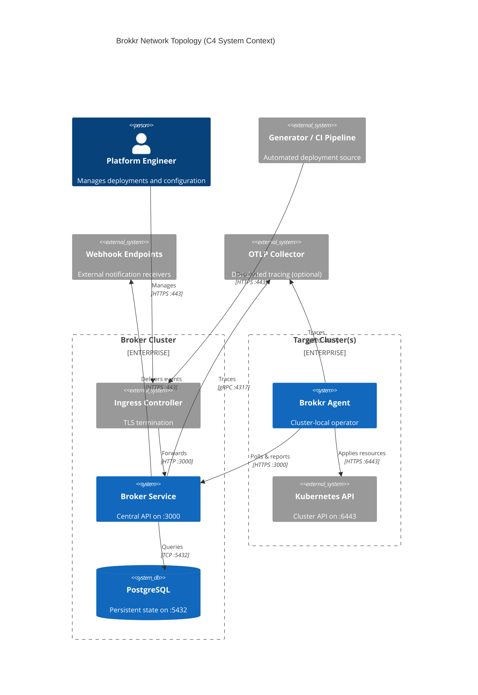

# Network Flows

This document explains the network traffic patterns between Brokkr components and the reasoning behind them. For the exact port-by-port connection matrix and firewall tables, see the [Network Ports reference](../reference/network-ports.md); for hands-on TLS, NetworkPolicy, and firewall setup, see the [Network Configuration how-to](../how-to/network-configuration.md).

## Network Topology

Brokkr implements a hub-and-spoke network topology where the broker acts as the central coordination point. All agents initiate outbound connections to the broker—there are no inbound connections required to agents. This pull-based model simplifies firewall configuration and enables agents to operate behind NAT without special accommodations.

The three zones above are the broker cluster (ingress, broker, database), the target clusters (agents and their local Kubernetes API), and the external endpoints the broker reaches outbound (webhooks, OTLP). All agent traffic is outbound to the broker; no connection is ever initiated toward an agent.

## Broker Network Profile

### Inbound Traffic

The broker service accepts all inbound traffic on a single port (3000), simplifying both service exposure and network policy configuration. In production this port is rarely accessed directly; an ingress controller typically terminates TLS and forwards traffic to the broker.

The broker service supports three exposure methods through its Helm chart:

**ClusterIP** is the default service type, restricting access to within the Kubernetes cluster. This configuration is appropriate when agents run in the same cluster as the broker or when an ingress controller handles external access.

**LoadBalancer** creates a cloud provider load balancer that exposes the service directly to external traffic. While simpler to configure than ingress, this approach requires managing TLS termination separately and may incur additional cloud provider costs.

**Ingress** (recommended for production) delegates external access and TLS termination to a Kubernetes ingress controller. This approach integrates with cert-manager for automatic certificate management and provides flexible routing options. Configuration examples are in the [Network Configuration how-to](../how-to/network-configuration.md#tls-configuration).

### Outbound Traffic

The broker initiates three types of outbound connections. Database connectivity to PostgreSQL is essential—the broker cannot operate without it. The Helm chart supports both bundled PostgreSQL (deployed as a subchart) and external PostgreSQL instances. For bundled deployments, the connection uses internal cluster DNS (`brokkr-broker-postgresql:5432`). External databases are configured via the `postgresql.external` values or by providing a complete connection URL through `postgresql.existingSecret`. For production deployments, TLS should be enabled by appending `?sslmode=require` or stronger modes to the connection string.

Webhook delivery represents the second outbound connection type. When webhooks are configured, the broker dispatches event notifications to external HTTP/HTTPS endpoints. The webhook delivery worker processes deliveries in batches, with the batch size and interval configurable via `broker.webhookDeliveryBatchSize` (default: 50) and `broker.webhookDeliveryIntervalSeconds` (default: 5). Failed deliveries are retried with exponential backoff.

OpenTelemetry tracing, when enabled, establishes gRPC connections to an OTLP collector. The collector endpoint is configured via `telemetry.otlpEndpoint`, and the sampling rate via `telemetry.samplingRate`. The Helm chart optionally deploys an OTel collector sidecar for environments where the main collector is not directly accessible.

## Agent Network Profile

### Outbound-Only Architecture

Agents operate with an outbound-only network model. They initiate all connections and require no inbound ports for their primary function. This design enables agents to operate behind restrictive firewalls and NAT gateways without special configuration—a critical feature for edge deployments and air-gapped environments.

The agent's network requirements are minimal: connectivity to the broker API and the local Kubernetes API server. When metrics scraping is enabled, the agent also accepts inbound connections from Prometheus on port 8080. The full destination list is in the [Network Ports reference](../reference/network-ports.md).

### Kubernetes API Access

Agents communicate with their local Kubernetes API server to apply and manage resources. When deployed via the Helm chart, agents use in-cluster configuration automatically—the Kubernetes client discovers the API server address from the cluster's DNS and service account credentials.

The Helm chart creates RBAC resources that grant agents permission to manage resources across the cluster (`rbac.clusterWide: true`) or within a single namespace. Namespace-scoped mode (`rbac.clusterWide: false`) deploys within its namespace, and the chart automatically sets `BROKKR__AGENT__WATCH_NAMESPACE` so telemetry streaming and health discovery operate in-namespace too. Remaining constraints: reconciliation pruning skips resource types it cannot list, and stacks containing cluster-scoped resources (Namespaces, CRDs) fail to apply. The agent can be restricted from sensitive resources like Secrets through the `rbac.secretAccess` configuration.

### Broker Connectivity

Agents poll the broker at a configurable interval. The agent binary's built-in default is 10 seconds; the Helm chart sets its own default of 30 seconds via the `agent.pollingInterval` value, which overrides the binary default in chart-based deployments. Each polling cycle fetches pending deployment objects and reports events for completed operations. The agent also sends deployment health status updates at a separate interval (default: 60 seconds, set via `agent.deploymentHealth.intervalSeconds`).

The broker URL is configured via the `broker.url` value in the agent's Helm chart. For deployments where the agent and broker share a cluster, an internal URL like `http://brokkr-broker:3000` provides optimal performance. For multi-cluster deployments, agents use the broker's external URL with TLS: `https://broker.example.com`.

Authentication uses Prefixed API Keys (PAKs), which agents include in the `Authorization` header of every request. The PAK is generated when an agent is registered and should be provided via `broker.pak` in the Helm values or through a Kubernetes Secret.

Alongside REST polling, the agent maintains a long-lived internal WebSocket connection to the broker over the same port; ingress timeout requirements for that channel are covered in the [Network Configuration how-to](../how-to/network-configuration.md#websocket-timeouts) and the channel itself in [Internal Broker↔Agent WS Channel](./internal-ws-channel.md).

## Securing the Paths

Two complementary mechanisms protect Brokkr's network paths. TLS protects traffic in transit: terminate at the ingress (recommended), at the broker directly, or automate certificates with cert-manager. Kubernetes NetworkPolicies provide defense-in-depth by restricting pod-to-pod and pod-to-external communication at the network layer; both Helm charts ship optional least-privilege policies. Concrete YAML for both, plus cloud provider firewall guidance and network troubleshooting steps, lives in the [Network Configuration how-to](../how-to/network-configuration.md).

## Related Documentation

- [Network Ports reference](../reference/network-ports.md) — complete connection matrix and firewall port tables
- [Network Configuration how-to](../how-to/network-configuration.md) — TLS, NetworkPolicy, cloud firewalls, and troubleshooting
- [Internal Broker↔Agent WS Channel](./internal-ws-channel.md) — the WebSocket optimization layer over REST
