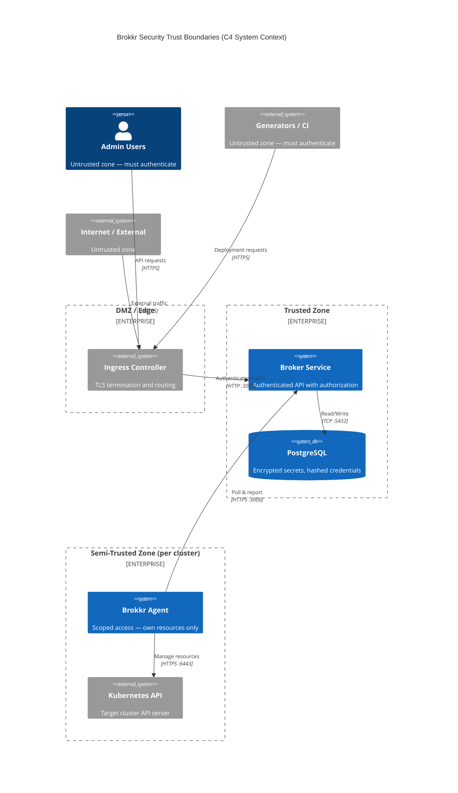
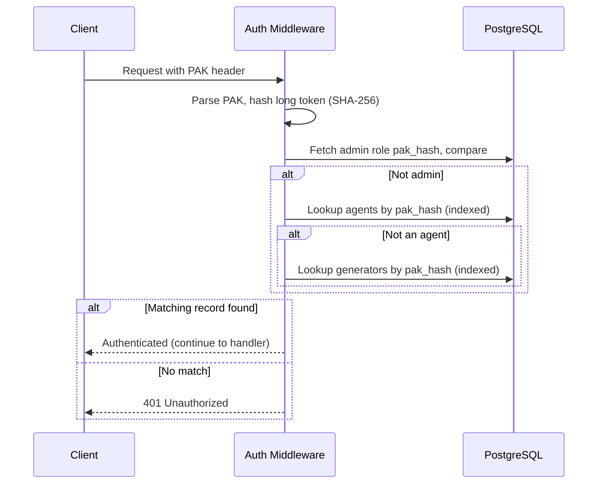

# Security Model

Security in Brokkr follows a defense-in-depth approach, implementing multiple layers of protection from network boundaries through application-level access controls. This document describes the trust boundaries, authentication mechanisms, authorization model, and operational security practices that protect Brokkr deployments.

## Trust Boundaries

Brokkr defines four distinct security zones, each with different trust levels and access controls. Understanding these boundaries is essential for secure deployment architecture and incident response.



- **Untrusted Zone** — all external entities (internet traffic, admin clients, CI/CD generators); nothing is implicitly trusted and every request must authenticate.
- **DMZ** — the edge where the ingress controller terminates TLS before traffic reaches application components.
- **Trusted Zone** — the broker and its PostgreSQL database, communicating over internal networks; the database accepts connections only from the broker.
- **Semi-Trusted Zone** — each target cluster's agent, scoped to resources targeted to it and unable to see other agents' resources, so a compromised agent can't reach other clusters.

### Security Principles

Four principles guide Brokkr's security architecture:

**Zero Trust by Default** requires all external requests to authenticate; the middleware rejects uncredentialed requests before any handler runs. The only anonymous endpoints are the health checks (`/healthz`, `/readyz`) and Prometheus `/metrics`, which sit outside the auth middleware.

**Least Privilege** restricts each identity to the minimum permissions necessary — agents to their associated stacks (explicit targets plus label/annotation matches), generators to stacks they created.

**Defense in Depth** layers overlapping controls: network security, then application-level authentication, then authorization, then audit logging.

**Immutable Audit Trail** records every significant action and supports only create and read — no updates or deletions — so forensic evidence stays intact.

## Authentication Mechanisms

Brokkr implements three authentication mechanisms, each designed for different actor types and usage patterns.

### Prefixed API Keys (PAKs)

PAKs serve as the primary authentication mechanism for agents and can also authenticate administrators and generators. The PAK design balances security with operational simplicity, enabling stateless authentication without storing plaintext secrets.

#### PAK Structure

Every PAK follows a structured format that embeds both an identifier and a secret component:

```
brokkr_BR{short_token}_{long_token}
       ^  ^            ^
       |  |            |
       |  |            +-- Long token (secret, used for verification)
       |  +--------------- Short token (identifier, safe to log)
       +------------------ Prefix (identifies key type)
```

A typical PAK looks like `brokkr_BRabc123_xyzSecretTokenHere...`, where `abc123` is the short token (a loggable identifier) and `xyzSecretTokenHere...` is the long token (the secret used for verification).

#### Generation Process

PAK generation occurs when creating agents, generators, or admin credentials. The process uses cryptographically secure randomness from the operating system's entropy source:

1. The system generates a random short token of configurable length. This token uses URL-safe characters and serves as a loggable identifier; database lookups during verification key off the long-token hash, not the short token.

2. A separate random long token is generated with sufficient entropy for cryptographic security. This token never leaves the generation response.

3. The long token is hashed using SHA-256, producing a fixed-size digest that represents the secret without revealing it.

4. The database stores only the hash. The original long token exists only in the complete PAK string returned to the caller.

5. The complete PAK is returned exactly once. If the caller loses it, a new PAK must be generated—the original cannot be recovered. Because only the hash is stored, a database breach reveals nothing that can authenticate without the original long tokens.

#### Verification Process

When a request arrives with a PAK, the authentication middleware executes a verification sequence:



The middleware parses the presented PAK and hashes its long token with the same SHA-256 algorithm used at generation time. A malformed PAK is rejected with 401 at this step. It then resolves the identity by that hash, in order: it fetches the admin role row and compares hashes, then performs an indexed lookup in the agents table by `pak_hash`, then in the generators table. The partial indexes on `pak_hash` exclude soft-deleted records, so lookups stay O(1) regardless of how many credentials exist.

Hash comparison uses a constant-time equality primitive (`subtle::ConstantTimeEq`) on the hex-encoded SHA-256 digests.

If verification succeeds, the middleware populates an `AuthPayload` structure identifying the authenticated entity (agent, generator, or admin) and attaches it to the request for downstream handlers. If verification fails, the request is rejected with a 401 status before reaching any route handler.

#### PAK Security Properties

| Property | Implementation |
|----------|----------------|
| **Secrecy** | Long token never stored; only SHA-256 hash persisted |
| **Non-repudiation** | PAK uniquely identifies the acting entity |
| **Revocation** | Entity can be disabled; PAK immediately invalid |
| **Rotation** | New PAK generated via rotate endpoint; old one invalidated |
| **Performance** | Indexed `pak_hash` lookup; O(1) regardless of credential count |

### Admin Authentication

Administrative users authenticate using PAKs stored in the `admin_role` table. Admin PAKs grant access to sensitive management operations that regular agents and generators cannot perform.

Admin authentication follows the same verification process as agent authentication, but the resulting `AuthPayload` sets the `admin` flag to true. Route handlers check this flag to authorize access to admin-only endpoints.

```bash
# Example admin API call
curl -X POST https://broker.example.com/api/v1/admin/config/reload \
  -H "Authorization: Bearer brokkr_BR..."
```

Admin credentials should be treated with extreme care. A compromised admin PAK grants access to all system data, configuration changes, and audit logs. Organizations should implement additional controls around admin credential storage and usage, such as hardware security modules or secrets management systems.

### Generator Authentication

Generators authenticate using PAKs stored in the `generators` table. Generator credentials enable CI/CD systems to create and manage deployments programmatically.

Generator permissions are scoped to resources they create. When a generator creates a stack, the broker records the generator's ID with that stack. Future operations on the stack verify the requesting generator matches the owner. This scoping prevents one generator from modifying another's deployments.

```bash
# Example generator API call
curl -X POST https://broker.example.com/api/v1/stacks \
  -H "Authorization: Bearer brokkr_BR..." \
  -H "Content-Type: application/json" \
  -d '{"name": "my-stack"}'
```

Generators cannot access admin endpoints regardless of their PAK. The authorization layer checks identity type before granting access to protected routes.

## Authorization Model

Brokkr implements implicit role-based access control (RBAC) where roles are determined by authentication type rather than explicit role assignments.

### Role Definitions

| Role | Authentication | Capabilities |
|------|----------------|--------------|
| **Agent** | PAK via agents table | Read targeted deployments, report events, claim work orders |
| **Generator** | PAK via generators table | Manage own stacks and deployment objects |
| **Admin** | PAK via admin_role table | Full system access including configuration and audit logs |
| **System** | Internal only | Background tasks, automated cleanup |

### Endpoint Authorization

The following table summarizes which roles can access each API endpoint category:

| Endpoint Pattern | Agent | Generator | Admin |
|------------------|-------|-----------|-------|
| `/api/v1/agents/{id}/target-state` | Own ID only | No | Yes |
| `/api/v1/agents/{id}/events` | Own ID only | No | Yes |
| `/api/v1/agents/{id}/work-orders/*` | Own ID only | No | Yes |
| `/api/v1/stacks/*` | No | Own stacks | Yes |
| `/api/v1/agents/*` (management) | No | No | Yes |
| `/api/v1/admin/*` | No | No | Yes |
| `/api/v1/webhooks/*` | No | No | Yes |
| `/healthz`, `/readyz` | Public (no auth) | Public (no auth) | Public (no auth) |
| `/metrics` | Public (no auth) | Public (no auth) | Public (no auth) |

Note that `/metrics` is mounted outside the authentication middleware, exactly like `/healthz` and `/readyz`—any client that can reach the broker port can scrape it. Metrics can reveal operational details (request rates, agent counts), so restrict access at the network level: use a NetworkPolicy (`networkPolicy.allowMetricsFrom`) or firewall rules to limit scraping to your monitoring infrastructure.

### Resource-Level Access Control

Beyond endpoint-level authorization, Brokkr enforces resource-level access control through database queries.

**Agent Scope** limits agents to resources from stacks associated with them. When an agent requests deployment objects, the broker resolves the agent's associated stacks as the union of explicit targets (`agent_targets` rows), stacks sharing any of the agent's labels, and stacks sharing any of the agent's annotations—then serves only those stacks' objects.

This resolution happens server-side on every request, so agents can never see deployment objects from stacks outside that union, regardless of what parameters they provide in API requests.

**Generator Scope** restricts generators to stacks they created:

```sql
SELECT * FROM stacks
WHERE generator_id = :requesting_generator_id
  AND deleted_at IS NULL;
```

Generators cannot list, read, or modify stacks created by other generators or through admin operations.

## Credential Management

### Storage

Brokkr stores credentials using appropriate protection levels based on sensitivity:

| Credential Type | Storage Location | Protection |
|-----------------|------------------|------------|
| PAK hashes | PostgreSQL | SHA-256 hash (plaintext never stored) |
| Webhook URLs | PostgreSQL | AES-256-GCM encryption |
| Webhook auth headers | PostgreSQL | AES-256-GCM encryption |
| Database password | Kubernetes Secret | Base64 encoding (use sealed-secrets in production) |
| Webhook encryption key | Environment variable | Should use Kubernetes Secret |

### Webhook Secret Encryption

Webhook URLs and authentication headers may contain sensitive information like API keys or tokens. Brokkr encrypts these values at rest using AES-256-GCM, a modern authenticated encryption algorithm.

The encryption format includes version information for future algorithm upgrades:

```
version (1 byte) || nonce (12 bytes) || ciphertext || tag (16 bytes)
```

The current version byte (`0x01`) indicates AES-256-GCM encryption. The 12-byte nonce ensures each encryption produces unique ciphertext even for identical plaintexts. The 16-byte authentication tag detects any tampering with the encrypted data.

The encryption key is configured via the `BROKKR__BROKER__WEBHOOK_ENCRYPTION_KEY` environment variable as a 64-character hexadecimal string (representing 32 bytes). If no key is configured, the broker generates a random key at startup and logs a warning. Production deployments should always configure an explicit key to ensure encrypted data survives broker restarts.

#### Legacy format and its inherent ambiguity (read-only)

Data written before the versioned format is a **headerless** `nonce (16 bytes) || ciphertext` XOR blob, supported **read-only** for one-time migration (a leading version byte `0x00` also routes to this path). Because a headerless blob has no version header, the decryptor falls back to the legacy path whenever the first byte is not a known version marker.

This leaves a small, inherent ambiguity: a legacy blob whose nonce happens to begin with `0x00` (legacy marker) or `0x01` (AES-GCM marker) is mis-routed and fails to decrypt. The window is tiny — roughly `2/256` (~0.78%) of legacy blobs — and is **bounded entirely to the read-only migration path**. It cannot affect new data: AES-256-GCM ciphertext always carries the `0x01` version byte and is dispatched unambiguously. The ambiguity is not fixable without a format change (headerless data is inherently undistinguishable from versioned data in that one byte), so the resolution is operational: let the migration re-encrypt legacy values into the versioned (`0x01`) format, after which the ambiguity no longer applies.

### PAK Rotation

PAK rotation replaces an entity's authentication credential without disrupting its identity or permissions. The `POST /api/v1/agents/{id}/rotate-pak` endpoint (and similar endpoints for generators) generates a new PAK and invalidates the previous one atomically.

After rotation, the old PAK becomes invalid immediately — the endpoint updates the stored hash, invalidates the broker's auth cache, and closes any open WebSocket authenticated with the old credential, all before returning the new PAK (which is shown once and cannot be retrieved again). The entity must then be reconfigured with the new PAK before its next broker communication. Step-by-step rotation procedures are in [Managing PAKs](../how-to/pak-management.md).

### Credential Revocation

Revoking access involves soft-deleting the associated entity. When an agent is deleted, its record remains in the database with a `deleted_at` timestamp, but authentication queries filter out deleted records:

```bash
# Revoke agent access
curl -X DELETE https://broker/api/v1/agents/{id} \
  -H "Authorization: Bearer <admin-pak>"
```

After revocation, the agent's PAK becomes invalid immediately. Existing deployments remain in the target cluster (Brokkr doesn't forcibly remove resources), but the agent can no longer fetch new deployments or report events.

## Audit Logging

The audit logging system records significant actions for security monitoring, compliance, and forensic analysis. The system prioritizes completeness and immutability while minimizing performance impact on normal operations.

### Architecture

The audit logger uses an asynchronous design to avoid blocking API request handlers:

```
API Handler → mpsc channel (10,000 buffer) → Background Writer → PostgreSQL
```

When an action occurs, the handler sends an audit entry to a bounded channel. A background task collects entries from this channel and writes them to PostgreSQL in batches. This design ensures audit logging never blocks request processing, even under high load.

The background writer batches entries for efficiency, flushing when the batch reaches 100 entries or after 1 second, whichever comes first. This batching reduces database round trips while ensuring entries are persisted within a predictable time window.

### Audit Log Contents

Each audit log entry captures comprehensive context about the action:

| Field | Description |
|-------|-------------|
| `timestamp` | When the action occurred (UTC) |
| `actor_type` | Identity type: admin, agent, generator, or system |
| `actor_id` | UUID of the acting entity (if applicable) |
| `action` | What happened (e.g., `agent.created`, `pak.rotated`) |
| `resource_type` | Type of affected resource |
| `resource_id` | UUID of affected resource (if applicable) |
| `details` | Structured JSON with action-specific data |
| `ip_address` | Client IP address (when available) |
| `user_agent` | Client user agent string (when available) |

### Recorded Actions

The audit system records lifecycle events for agents, generators, templates, stacks, work orders, and webhook subscriptions; PAK issuance and rotation (`pak.created`/`pak.rotated`, via REST or CLI); webhook deliveries that exhaust retries (`webhook.delivery_failed`); failed authentication attempts (`auth.failed`, with source IP and request path); and configuration reloads (`config.reloaded`, with the change set). Two constants are intentionally unrecorded — `auth.success` (volume) and `pak.deleted` (PAKs die with their entity) — see the [Audit Logs Reference](../reference/audit-logs.md).

### Query Capabilities

The audit log API supports filtering to find relevant entries:

```bash
# Recent authentication failures
curl "https://broker/api/v1/admin/audit-logs?action=auth.failed&limit=100" \
  -H "Authorization: Bearer <admin-pak>"

# Actions by specific agent
curl "https://broker/api/v1/admin/audit-logs?actor_type=agent&actor_id=<uuid>" \
  -H "Authorization: Bearer <admin-pak>"

# All admin actions in a time range
curl "https://broker/api/v1/admin/audit-logs?actor_type=admin&from=2024-01-01T00:00:00Z" \
  -H "Authorization: Bearer <admin-pak>"
```

Filters support actor type and ID, action (with wildcard prefix matching), resource type and ID, and time ranges. Pagination limits responses to manageable sizes, with a maximum of 1000 entries per request.

### Retention and Cleanup

Audit logs are retained for a configurable period (default: 90 days). A background task runs daily to remove entries older than the retention period. This cleanup prevents unbounded database growth while maintaining sufficient history for security investigations.

The retention period is configurable via broker settings, allowing organizations to meet their specific compliance requirements.

## Kubernetes Security

### Pod Security

Both broker and agent deployments configure security contexts that follow Kubernetes security best practices:

```yaml
podSecurityContext:
  runAsNonRoot: true
  runAsUser: 10001
  runAsGroup: 10001
  fsGroup: 10001

containerSecurityContext:
  allowPrivilegeEscalation: false
  readOnlyRootFilesystem: false  # Configurable
  capabilities:
    drop:
      - ALL
```

**Non-root execution** prevents containers from running as the root user, limiting the impact of container escape vulnerabilities. The UID 10001 is arbitrary but consistent across components.

**Privilege escalation prevention** blocks processes from gaining additional capabilities after container startup, closing a common attack vector.

**Capability dropping** removes all Linux capabilities by default. Most applications don't need capabilities, and removing them reduces attack surface.

**AppArmor support** is available when enabled via `apparmor.enabled: true`. AppArmor provides mandatory access control at the kernel level, further restricting what container processes can do.

### Agent RBAC

The agent requires Kubernetes permissions to manage resources in target clusters. The Helm chart creates RBAC resources that implement least-privilege access:

**Resource management access** to core resources (pods, services, configmaps, deployments, and others) enables the agent to apply, update, and delete resources as part of deployment management. The agent requires create, get, list, watch, update, patch, and delete permissions on the resources it manages.

**Shipwright access** (when enabled) grants create, update, and delete permissions on Build and BuildRun resources for container image builds.

**Optional secret access** is disabled by default. When enabled via `rbac.secretAccess.enabled`, the agent can list and watch secrets. The `rbac.secretAccess.readContents` flag controls whether the agent can read actual secret values.

The RBAC configuration supports both namespace-scoped (Role/RoleBinding) and cluster-wide (ClusterRole/ClusterRoleBinding) permissions, configured via `rbac.clusterWide`. Namespace-scoped mode (`rbac.clusterWide: false`) deploys within its namespace, and the chart automatically sets `BROKKR__AGENT__WATCH_NAMESPACE` so telemetry streaming and health discovery operate in-namespace too. Remaining constraints: reconciliation pruning skips resource types it cannot list, and stacks containing cluster-scoped resources (Namespaces, CRDs) fail to apply.

## Security Best Practices

Operational hardening guidance—the production deployment checklist, security monitoring thresholds, and incident response procedures for suspected agent or broker compromise—lives in the [Security Hardening how-to guide](../how-to/security-hardening.md).

## Compliance Considerations

Brokkr implements several controls relevant to data protection regulations, summarized in the mapping below.

### Regulatory Mapping

| Requirement | Brokkr Feature |
|-------------|----------------|
| Access control | PAK authentication + implicit RBAC |
| Audit trail | Immutable audit logs with comprehensive action recording |
| Data encryption | TLS in transit, AES-256-GCM for secrets at rest |
| Least privilege | Scoped agent and generator access |
| Monitoring | Metrics endpoint, audit log queries |
| Incident response | Credential revocation, audit log forensics |
